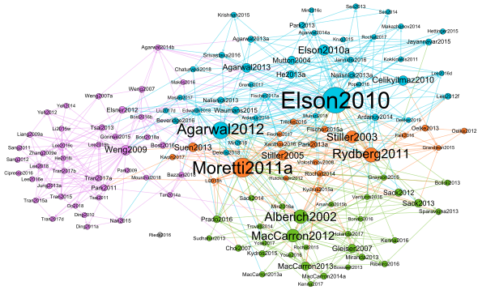

This page is related to the following article:

V. Labatut and X. Bost, “*Extraction and Analysis of Fictional Character Networks: A Survey*,” ACM Computing Surveys 52(5):89, 2019. 
DOI: [10.1145/3344548](http://doi.org/10.1145/3344548) -- [arxiv:1907.02704](https://arxiv.org/abs/1907.02704) -- ⟨[hal-02173918](https://hal.archives-ouvertes.fr/hal-02173918)⟩

It aims at hosting an up-to-date list of academic articles related to the extraction and analysis of character networks from works of fiction.

If you use these resources, please cite the above article.

  

<!--

-->

# Contents
* [Available Resources](#available-resources)
* [List of Academic Articles](#list-of-academic-articles)
* [List of Mainstream or Instructional Pages](#list-of-mainstream-or-instructional-pages)
* [Contact](#contact)

# Available Resources
The resources associated to the article are available through the following links:

* [`table_bib.ods`](/assets/data/table_bib.ods): LibreOffice table listing the articles with their main information.
* [`charnets.bib`](/assets/data/charnets.bib): BibTeX file containing the bibliographic entries of these articles, as well as the ones they cite (the latter are not represented in the below graphs).
* [`article_citation.graphml`](/assets/data/article_citation.graphml): article citation network, i.e. graph whose vertices are the listed articles and edges represent them citing each other.
* [`article_cociting.graphml`](/assets/data/article_cociting.graphml): same, but the edges represent how much two articles cite the same bibliographic references.

# List of Academic Articles
List of methods designed to extract character networks from fictional works. The *Relationships* column indicates whether the edges correspond to co-occurrences (*Cc.*), conversations (*Cv.*), mentions (*M.*), direct actions (*Ac.*), or affiliations (*Af.*). The *Graph* column shows whether the extracted networks are weighted (*W.*), directed (*Di.*), signed (*S.*), and dynamic (*Dy.*). When the authors experiment with different methods, several values may appear in the same cell. Note that this table has been completed after the publication of the official ACM CS article.

<table>
  <tr style="background-color:#bfbfbf"><td><b>Work of fiction</b></td><td><b>Reference</b></td><td colspan="5"><b>Relationships</b></td><td colspan="4"><b>Graph</b></td><td><b>Application</b></td></tr>
  <tr style="background-color:#e3e3e3"><td/><td/><td><b>Cc.</b></td><td><b>Cv.</b></td><td><b>M.</b></td><td><b>Ac.</b></td><td><b>Af.</b></td><td><b>W.</b></td><td><b>Di.</b></td><td><b>S.</b></td><td><b>Dy.</b></td><td/></tr>
  <tr><td>Mozart's <i>Cosi Fan Tutte</i></td><td><a href="http://doi.org/10.2466/pr0.1963.13.2.466">Harary1963</a></td><td>N</td><td>N</td><td>N</td><td>N</td><td>Y</td><td>N</td><td>N</td><td>Y</td><td>Y</td><td>Descriptive analysis</td></tr>
  <tr><td>Murdoch's <i>A Severed Head</i></td><td><a href="http://doi.org/10.2466/pr0.1966.19.2.473">Harary1966a</a></td><td>N</td><td>N</td><td>N</td><td>N</td><td>Y</td><td>N</td><td>N</td><td>N</td><td>N</td><td>Descriptive analysis</td></tr>
  <tr><td>Shakespeare's <i>A Midsummer Night's Dream</i></td><td><a href="http://doi.org/10.2466/pr0.1967.20.2.657">Stanton1967</a></td><td>N</td><td>N</td><td>N</td><td>N</td><td>Y</td><td>N</td><td>N</td><td>Y</td><td>Y</td><td>Descriptive analysis</td></tr>
  <tr><td>Wagner's <i>Der Ring des Nibelungen</i></td><td><a href="https://www.persee.fr/doc/roman_0048-8593_1973_num_3_6_4957">Mayer1973</a></td><td>N</td><td>N</td><td>N</td><td>N</td><td>Y</td><td>N</td><td>Y</td><td>Y</td><td>N</td><td>Descriptive analysis</td></tr>
  <tr><td>Shakespeare's <i>Twelfth Night</i></td><td><a href="http://www.numdam.org/item/MSH_1975__51__77_0/">Harary1975</a></td><td>N</td><td>N</td><td>N</td><td>N</td><td>Y</td><td>N</td><td>Y</td><td>Y</td><td>N</td><td>Descriptive analysis</td></tr>
  <tr><td>16 fairy tales</td><td><a href="http://doi.org/10.2466/pr0.1980.47.1.183">Auster1980</a></td><td>N</td><td>N</td><td>N</td><td>N</td><td>Y</td><td>N</td><td>N</td><td>Y</td><td>Y</td><td>Descriptive analysis</td></tr>
  <tr><td>Sophocles' <i>Oedipus Rex</i></td><td><a href="https://dokumen.tips/documents/oedipus-loves-his-mother.html">Harary1982</a></td><td>N</td><td>N</td><td>N</td><td>N</td><td>Y</td><td>N</td><td>Y</td><td>N</td><td>N</td><td>Descriptive analysis</td></tr>
  <tr><td>Priestley's <i>Dangerous Corner</i></td><td><a href="http://doi.org/10.1515/semi.1985.54.3-4.387">Harary1985</a></td><td>N</td><td>N</td><td>N</td><td>N</td><td>Y</td><td>N</td><td>Y</td><td>Y</td><td>N</td><td>Comparative study</td></tr>
  <tr><td>5 classic novels</td><td><a href="http://www-cs-faculty.stanford.edu/~knuth/sgb.html">Knuth1993</a></td><td>Y</td><td>N</td><td>N</td><td>N</td><td>N</td><td>N</td><td>N</td><td>N</td><td>N</td><td>Benchmark for graph processing tools</td></tr>
  <tr><td><i>Marvel</i> comics</td><td><a href="http://arxiv.org/abs/cond-mat/0202174">Alberich2002</a></td><td>Y</td><td>N</td><td>N</td><td>N</td><td>N</td><td>N</td><td>N</td><td>N</td><td>N</td><td>Level of realism</td></tr>
  <tr><td>10 Shakespeare's plays</td><td><a href="http://doi.org/10.1007/s12110-003-1013-1">Stiller2003</a>, <a href="http://doi.org/10.1556/JCEP.3.2005.1.4">Stiller2005</a></td><td>Y</td><td>N</td><td>N</td><td>N</td><td>N</td><td>N</td><td>N</td><td>N</td><td>N</td><td>Level of realism</td></tr>
  <tr><td>All of Shakespeare's plays</td><td><a href="http://doi.org/10.1109/IV.2004.1320122">Mutton2004</a></td><td>N</td><td>Y</td><td>N</td><td>N</td><td>N</td><td>Y</td><td>N</td><td>N</td><td>N/Y</td><td>Visualization</td></tr>
  <tr><td>Dictionary of Greek and Roman mythology</td><td><a href="http://doi.org/10.1016/j.physa.2007.04.035">Choi2007</a></td><td>N</td><td>N</td><td>Y</td><td>N</td><td>N</td><td>N</td><td>N/Y</td><td>N</td><td>N</td><td>Descriptive analysis</td></tr>
  <tr><td><i>Marvel</i> comics</td><td><a href="http://doi.org/10.1088/1742-5468/2007/09/P09020">Gleiser2007</a></td><td>Y</td><td>N</td><td>N</td><td>N</td><td>N</td><td>Y</td><td>N</td><td>N</td><td>N</td><td>Level of realism</td></tr>
  <tr><td>Dream reports</td><td><a href="http://doi.org/10.4324/9780203837672-22">Schweickert2007a</a>, <a href="http://doi.org/10.3758/bf03194063">Schweickert2007b</a>, <a href="https://books.google.fr/books?id=fRI1bycEjYgC">Schweickert2012</a></td><td>Y</td><td>N</td><td>N</td><td>N</td><td>N</td><td>N</td><td>N</td><td>N</td><td>N</td><td>Level of realism</td></tr>
  <tr><td>Hollywood movies, and TV series</td><td><a href="http://doi.org/10.1109/ICME.2007.4284922">Weng2007</a>, <a href="http://doi.org/10.1145/1290082.1290092">Weng2007a</a>, <a href="http://doi.org/10.1109/TMM.2008.2009684">Weng2009</a></td><td>Y</td><td>N</td><td>N</td><td>N</td><td>N</td><td>Y</td><td>N</td><td>N</td><td>N</td><td>Storyline identification/segmentation</td></tr>
  <tr><td>9 classical plays</td><td><a href="http://ets.ifmo.ru/tomasov/konferenc/AutoPlay/Docs/Volume%204/8_06.pdf">Voloshinov2008</a></td><td>N</td><td>Y</td><td>N</td><td>N</td><td>N</td><td>N</td><td>N</td><td>N</td><td>N</td><td>Level of realism</td></tr>
  <tr><td>Movies and TV series</td><td><a href="http://doi.org/10.1109/WI-IAT.2009.54">Park2009</a>, <a href="http://doi.org/10.1007/s11042-011-0725-1">Park2011</a></td><td>N</td><td>Y</td><td>N</td><td>N</td><td>N</td><td>Y</td><td>Y</td><td>N</td><td>N</td><td>Role detection, story segmentation</td></tr>
  <tr><td><i>Friends</i> TV show</td><td><a href="http://doi.org/10.1145/1734605.1734655">Yuan2009</a>, <a href="http://doi.org/10.1109/icassp.2010.5494953">Yuan2010</a></td><td>Y</td><td>N</td><td>N</td><td>N</td><td>N</td><td>Y</td><td>N</td><td>N</td><td>N</td><td>Method assessment</td></tr>
  <tr><td>15 Hollywood movies</td><td><a href="http://doi.org/10.1109/TMM.2009.2030629">Zhang2009e</a>, <a href="http://doi.org/10.1007/978-3-642-10467-1_82">Liang2009a</a>, <a href="http://doi.org/10.1109/ICME.2011.6011837">Sang2011</a>, <a href="http://doi.org/10.1109/TMM.2012.2188784">Sang2012</a></td><td>Y</td><td>N</td><td>N</td><td>N</td><td>N</td><td>Y</td><td>N</td><td>N</td><td>N</td><td>Face-name matching, Scene segmentation</td></tr>
  <tr><td>Austen's <i>Pride & prejudice</i>, and <i>Emma</i></td><td><a href="https://webdocs.cs.ualberta.ca/~denilson/files/publications/nips2010.pdf">Celikyilmaz2010</a></td><td>N</td><td>Y</td><td>N</td><td>N</td><td>N</td><td>Y</td><td>N</td><td>N</td><td>N</td><td>Method assessment</td></tr>
  <tr><td>10 adversarial movies</td><td><a href="http://doi.org/10.1007/978-3-642-15561-1_30">Ding2010</a></td><td>Y</td><td>N</td><td>N</td><td>N</td><td>N</td><td>Y</td><td>N</td><td>Y</td><td>N</td><td>Method assessment</td></tr>
  <tr><td>60 19th century British novels</td><td><a href="http://dl.acm.org/citation.cfm?id=1858696">Elson2010</a>, <a href="https://dl.acm.org/citation.cfm?id=2898607.2898769">Elson2010a</a>, <a href="http://www.cs.columbia.edu/~delson/pubs/Modeling-Narrative-Discourse_Elson_R4.pdf">Elson2012</a></td><td>N/Y</td><td>N/Y</td><td>N/Y</td><td>N</td><td>N</td><td>Y</td><td>N</td><td>N</td><td>N</td><td>Check literary theories</td></tr>
  <tr><td>20 Hollywood movies</td><td><a href="http://doi.org/10.1109/ICCV.2011.6126306">Ding2011a</a></td><td>Y</td><td>N</td><td>N</td><td>N</td><td>N</td><td>Y</td><td>N</td><td>Y</td><td>Y</td><td>Community detection</td></tr>
  <tr><td>300 19th century Swedish novels</td><td><a href="http://aclweb.org/anthology/W11-4111">Kokkinakis2011</a></td><td>Y</td><td>N</td><td>N</td><td>Y</td><td>Y</td><td>N</td><td>N</td><td>N</td><td>N</td><td>Method assessment</td></tr>
  <tr><td>Toriyama's <i>Dragon Ball</i> vol.32</td><td><a href="https://www.scitepress.org/Papers/2011/31965/31965.pdf">Murakami2011</a></td><td>Y</td><td>N</td><td>N</td><td>N</td><td>N</td><td>Y</td><td>N</td><td>N</td><td>N</td><td>Method assessment</td></tr>
  <tr><td>Shakespeare's <i>Hamlet</i>, <i>Macbeth</i>, and <i>King Lear</i></td><td><a href="http://litlab.stanford.edu/LiteraryLabPamphlet2.pdf">Moretti2011a</a></td><td>N</td><td>Y</td><td>N</td><td>N</td><td>N</td><td>N</td><td>N</td><td>N</td><td>N</td><td>Discussion about the characters</td></tr>
  <tr><td>Collection of Greek Tragedies</td><td><a href="https://letterpress.uchicago.edu/index.php/jdhcs/article/view/86">Rydberg2011</a></td><td>N</td><td>Y</td><td>N</td><td>N</td><td>N</td><td>N</td><td>Y</td><td>N</td><td>N</td><td>Plot structure comparison</td></tr>
  <tr><td>8 Hollywood movies</td><td><a href="http://doi.org/10.1145/2072298.2072413">Tsai2011</a></td><td>Y</td><td>N</td><td>N</td><td>N</td><td>N</td><td>N</td><td>N</td><td>N</td><td>Y</td><td>Scene segmentation</td></tr>
  <tr><td>Carroll's <i>Alice in Wonderland</i></td><td><a href="https://www.aclweb.org/anthology/P11-3020/">Agarwal2011</a>, <a href="http://www.cs.columbia.edu/~apoorv/Homepage/Publications_files/naacl2012.pdf">Agarwal2012</a>, <a href="http://www.aclweb.org/website/old_anthology/I/I13/I13-1171.pdf">Agarwal2013</a>, <a href="http://www.aclweb.org/anthology/I13-2009">Agarwal2013a</a>, <a href="https://pdfs.semanticscholar.org/2b67/dfc9f9688eb2b53cdd9cd2ab3dcd373c82f0.pdf">Agarwal2014a</a></td><td>N</td><td>N</td><td>N</td><td>Y</td><td>N</td><td>N</td><td>N/Y</td><td>N</td><td>N/Y</td><td>Role detection</td></tr>
  <tr><td>41 19th century novels</td><td><a href="http://www.aclweb.org/anthology/E12-1065">Elsner2012</a></td><td>Y</td><td>N</td><td>N</td><td>N</td><td>N</td><td>Y</td><td>N</td><td>N</td><td>Y</td><td>Genre comparison</td></tr>
  <tr><td>Rowling's <i>Harry Potter</i> novels</td><td><a href="https://mindmodeling.org/cogsci2012/papers/0096/paper0096.pdf">Hutchinson2012</a></td><td>Y</td><td>N</td><td>N</td><td>N</td><td>N</td><td>Y</td><td>N</td><td>N</td><td>N</td><td>Method assessment</td></tr>
  <tr><td>The <i>Old Testament</i></td><td><a href="https://aclanthology.info/papers/Y12-1022/y12-1022">Lee2012f</a></td><td>N</td><td>Y</td><td>N</td><td>Y</td><td>Y</td><td>N</td><td>N</td><td>N</td><td>N</td><td>Method assessment</td></tr>
  <tr><td>4 European tales</td><td><a href="http://doi.org/10.1209/0295-5075/99/28002">MacCarron2012</a>, <a href="http://doi.org/10.1140/epjb/e2013-40583-3">MacCarron2013</a>, <a href="http://users.complexity-coventry.org/~kenna/MacCarronKenna.pdf">MacCarron2013b</a>, <a href="http://doi.org/10.1111/j.1740-9713.2013.00704.x">MacCarron2013a</a>, <a href="https://ora.ox.ac.uk/objects/uuid:43275d59-4db2-49db-b26a-96f21378cfa8">MacCarron2014a</a>, <a href="http://doi.org/10.1088/1742-6596/681/1/012002">Kenna2016</a>, <a href="http://doi.org/10.1007/978-3-319-39445-9_3">Kenna2017</a></td><td>Y</td><td>Y</td><td>Y</td><td>Y</td><td>Y</td><td>N/Y</td><td>N</td><td>Y</td><td>N</td><td>Level of historicity</td></tr>
  <tr><td>19th and 20th century Swedish novels</td><td><a href="https://dl.acm.org/citation.cfm?id=2390364">Oelke2012</a>, <a href="http://doi.org/10.1111/cgf.12124">Oelke2013</a></td><td>Y</td><td>N</td><td>N</td><td>N</td><td>N</td><td>Y</td><td>N</td><td>N</td><td>N/Y</td><td>Visualization</td></tr>
  <tr><td>6 canonical European novels</td><td><a href="http://www.aaai.org/ocs/index.php/AIIDE/AIIDE12/paper/view/5550">Sack2012</a>, <a href="http://doi.org/10.4230/OASIcs.CMN.2013.183">Sack2013</a>, <a href="http://doi.org/10.4032/9789814463270">Sack2014</a></td><td>Y</td><td>N</td><td>N</td><td>N</td><td>N</td><td>Y</td><td>N</td><td>N</td><td>N</td><td>Proto-narrative generation</td></tr>
  <tr><td>Frankel's <i>The Devil Wears Prada</i></td><td><a href="http://doi.org/10.1109/ICMEW.2012.48">Yeh2012</a>, <a href="http://doi.org/10.1109/MMUL.2014.24">Yeh2014</a></td><td>Y</td><td>N</td><td>N</td><td>N</td><td>N</td><td>Y</td><td>N</td><td>N</td><td>N</td><td>Face clustering</td></tr>
  <tr><td>Manzoni's <i>I promessi sposi</i></td><td><a href="http://doi.org/10.4230/OASIcs.CMN.2013.30">Bolioli2013</a></td><td>N/Y</td><td>N/Y</td><td>N</td><td>N</td><td>N</td><td>Y</td><td>N</td><td>N</td><td>N</td><td>Method assessment</td></tr>
  <tr><td>Rowling's <i>Harry Potter</i> novels</td><td><a href="http://doi.org/10.4236/ojapps.2013.32024">Bossaert2013</a></td><td>N</td><td>N</td><td>N</td><td>Y</td><td>N</td><td>N</td><td>Y</td><td>N</td><td>N</td><td>Study of peer support</td></tr>
  <tr><td>3 classic European novels</td><td><a href="http://www.aclweb.org/anthology/P13-1129">He2013a</a>, <a href="https://arxiv.org/abs/1405.0603">Makazhanov2014</a></td><td>N</td><td>Y</td><td>N</td><td>N</td><td>Y</td><td>N</td><td>N</td><td>N</td><td>N</td><td>Method assessment</td></tr>
  <tr><td>10 Hollywood movie scripts</td><td><a href="http://doi.org/10.1007/s11042-012-1133-x">Jung2013a</a></td><td>N</td><td>Y</td><td>N</td><td>N</td><td>N</td><td>Y</td><td>Y</td><td>N</td><td>N</td><td>Role detection</td></tr>
  <tr><td>Homer's <i>Odyssey</i></td><td><a href="http://arxiv.org/abs/1306.2537">Miranda2013</a>, <a href="http://doi.org/10.1371/journal.pone.0200703">Miranda2018</a></td><td>Y</td><td>Y</td><td>Y</td><td>Y</td><td>Y</td><td>N</td><td>N</td><td>N</td><td>N</td><td>Level of historicity</td></tr>
  <tr><td>Shakespeare's plays</td><td><a href="http://www.aclweb.org/anthology/P13-2085">Nalisnick2013</a>, <a href="http://doi.org/10.1109/ICDAR.2013.155">Nalisnick2013a</a></td><td>N</td><td>Y</td><td>N</td><td>N</td><td>N</td><td>Y</td><td>Y</td><td>Y</td><td>Y</td><td>Method assessment</td></tr>
  <tr><td>20 novels</td><td><a href="http://doi.org/10.7763/IJMLC.2013.V3.282">Park2013</a>, <a href="http://www.jcomputers.us/vol8/jcp0809-38.pdf">Park2013a</a>, <a href="http://doi.org/10.1109/CW.2013.72">Seo2013</a>, <a href="http://doi.org/10.1145/2554850.2555049">Seo2014</a></td><td>Y</td><td>N</td><td>N</td><td>N</td><td>N</td><td>Y</td><td>N</td><td>N</td><td>N</td><td>Descriptive analysis</td></tr>
  <tr><td>Rowling's <i>Harry Potter and the Philosopher's Stone</i></td><td><a href="http://doi.org/10.18483/ijSci.312">Sparavigna2013</a></td><td>N</td><td>Y</td><td>Y</td><td>Y</td><td>Y</td><td>N</td><td>N</td><td>N</td><td>N</td><td>Level of realism</td></tr>
  <tr><td>3 story books</td><td><a href="http://doi.org/10.1.1.429.3639">Sudhahar2013</a></td><td>N</td><td>N</td><td>N</td><td>Y</td><td>N</td><td>Y</td><td>Y</td><td>N</td><td>N</td><td>Role detection</td></tr>
  <tr><td>173 theater and 580 movie scripts</td><td><a href="http://snap.stanford.edu/class/cs224w-2011/proj/laneyk_Finalwriteup_v1.pdf">Suen2013</a></td><td>N/Y</td><td>N/Y</td><td>N</td><td>N</td><td>N</td><td>Y</td><td>N</td><td>N</td><td>N</td><td>Classification of works</td></tr>
  <tr><td>12 Hollywood movies</td><td><a href="http://doi.org/10.1109/TCSVT.2013.2269186">Tsai2013</a></td><td>Y</td><td>N</td><td>N</td><td>N</td><td>N</td><td>N</td><td>N</td><td>N</td><td>N</td><td>Video summarization</td></tr>
  <tr><td>674 movie scripts</td><td><a href="http://www.aclweb.org/anthology/W14-0907">Agarwal2014b</a>, <a href="http://doi.org/10.7916/D8571C9Z">Agarwal2016</a></td><td>N</td><td>Y</td><td>N</td><td>N</td><td>N</td><td>N</td><td>N</td><td>N</td><td>N</td><td>Performance evaluation</td></tr>
  <tr><td>238 novels</td><td><a href="http://www.aclweb.org/anthology/W14-0905">Ardanuy2014</a>, <a href="http://csli-lilt.stanford.edu/ojs/index.php/LiLT/article/view/60">Ardanuy2015</a></td><td>Y</td><td>N</td><td>N</td><td>N</td><td>N</td><td>Y</td><td>N</td><td>N</td><td>N</td><td>Classification of works</td></tr>
  <tr><td>250,000 novels, myths and fary tales</td><td><a href="http://www.dialog-21.ru/digests/dialog2014/materials/pdf/BodrovaAABocharovVV.pdf">Bodrova2014</a></td><td>Y</td><td>N</td><td>N</td><td>Y</td><td>N</td><td>N</td><td>N</td><td>N</td><td>N</td><td>Method assessment</td></tr>
  <tr><td>1,800 19th century British and American novels</td><td><a href="https://idrh.drupal.ku.edu/sites/idrh.ku.edu/files/files/dhforum2014/abstract-Condello-Character-Networks.pdf">Condello2014</a></td><td>Y</td><td>N</td><td>N</td><td>N</td><td>N</td><td>Y</td><td>N</td><td>N</td><td>N</td><td>Comparative study</td></tr>
  <tr><td>Tales and myths</td><td><a href="https://curve.coventry.ac.uk/open/file/9bfc043d-497e-4217-82ab-e19963b53290/1/maccarroncomb.pdf">MacCarron2014</a></td><td>Y</td><td>Y</td><td>Y</td><td>Y</td><td>Y</td><td>N</td><td>N</td><td>Y</td><td>N</td><td>Level of historicity, Categorization</td></tr>
  <tr><td><i>Das Nibelungenlied</i>, and Shakespeare's <i>Hamlet</i></td><td><a href="https://arxiv.org/abs/1402.4259">Marazzato2014</a>, <a href="https://papers.ssrn.com/sol3/papers.cfm?abstract_id=2741067">Sparavigna2015</a></td><td>Y</td><td>N</td><td>N</td><td>N</td><td>N</td><td>Y</td><td>N</td><td>N</td><td>N</td><td>Method assessment</td></tr>
  <tr><td>Rousseau's <i>Les confessions</i></td><td><a href="http://infoscience.epfl.ch/record/203889/files/yrochat_thesis_infoscience.pdf">Rochat2014a</a>, <a href="http://doi.org/10.3166/LCN.10.3.109-133">Rochat2014</a></td><td>Y</td><td>N</td><td>N</td><td>N</td><td>N</td><td>N/Y</td><td>N</td><td>N</td><td>N/Y</td><td>Role detection</td></tr>
  <tr><td>Shakespeare's <i>Hamlet</i> and <i>Othello</i></td><td><a href="http://doi.org/10.18483/ijSci.414">Sparavigna2014a</a></td><td>N</td><td>Y</td><td>N</td><td>N</td><td>N</td><td>N</td><td>N</td><td>N</td><td>N</td><td>Descriptive analysis</td></tr>
  <tr><td><i>Star Trek</i> and <i>Star Gate</i> movies and TV series scripts</td><td><a href="http://doi.org/10.1063/1.4866954">Tan2014a</a>, <a href="http://doi.org/10.1142/s0129183117500176">Tan2017</a>, <a href="http://myto.upm.edu.my/find/Record/um.u1112507">Tan2018a</a></td><td>Y</td><td>N</td><td>N</td><td>N</td><td>N</td><td>Y</td><td>N</td><td>N</td><td>N</td><td>Comparative study</td></tr>
  <tr><td>Knowles' <i>The Legends of King Arthur and his Knights</i></td><td><a href="http://doi.org/10.1109/DEXA.2014.58">Trovati2014</a></td><td>N</td><td>N</td><td>N</td><td>Y</td><td>N</td><td>N</td><td>N</td><td>Y</td><td>N</td><td>Method assessment</td></tr>
  <tr><td>Rowling's <i>Harry Potter</i> series</td><td><a href="http://doi.org/10.11591/telkomnika.v12i8.5331">Zhang2014q</a></td><td>N</td><td>N</td><td>N</td><td>N</td><td>Y</td><td>N</td><td>N</td><td>N</td><td>N</td><td>Descriptive analysis</td></tr>
  <tr><td>20 novels</td><td><a href="http://doi.org/10.1209/0295-5075/114/58005">Amancio2015b</a></td><td>Y</td><td>N</td><td>N</td><td>N</td><td>N</td><td>Y</td><td>N</td><td>N</td><td>N</td><td>Descriptive analysis</td></tr>
  <tr><td>1,276 movie scripts</td><td><a href="http://www.aclweb.org/anthology/N15-1113">Gorinski2015</a></td><td>Y</td><td>N</td><td>N</td><td>N</td><td>N</td><td>Y</td><td>N</td><td>N</td><td>N</td><td>Script summarization</td></tr>
  <tr><td>Dream reports</td><td><a href="http://doi.org/10.1111/cogs.12244">Han2015b</a>, <a href="http://doi.org/10.11588/IJODR.2020.2.71370">Schweickert2019</a>, <a href="http://doi.org/10.11588/IJODR.2020.2.71370">Schweickert2020</a>, <a href="http://doi.org/10.11588/ijodr.2022.1.85607">Schredl2022</a></td><td>Y</td><td>N</td><td>N</td><td>N</td><td>N</td><td>N</td><td>N</td><td>N</td><td>N</td><td>Check theories, Descriptive analysis</td></tr>  
  <tr><td>1,682 16--20th century German novels</td><td><a href="http://doi.org/10.1109/DEXA.2015.62">Hettinger2015</a></td><td>Y</td><td>N</td><td>N</td><td>N</td><td>N</td><td>N</td><td>N</td><td>N</td><td>N</td><td>Classification of works</td></tr>
  <tr><td>60 19th century British novels</td><td><a href="http://anthology.aclweb.org/W/W15/W15-07.pdf#page=46">Jayannavar2015</a></td><td>N</td><td>Y</td><td>N</td><td>Y</td><td>N</td><td>N/Y</td><td>N/Y</td><td>N</td><td>N</td><td>Check literary theories</td></tr>
  <tr><td>200 17--18th century French plays</td><td><a href="https://drops.dagstuhl.de/opus/volltexte/2015/5283/">Karsdorp2015</a></td><td>Y</td><td>N</td><td>N</td><td>N</td><td>N</td><td>Y</td><td>N</td><td>N</td><td>N</td><td>Character ranking, Visualization</td></tr>
  <tr><td>617 movie scripts</td><td><a href="http://www.aclweb.org/anthology/N15-1185">Krishnan2015</a></td><td>N</td><td>Y</td><td>N</td><td>N</td><td>N</td><td>N</td><td>N</td><td>Y</td><td>N</td><td>Infer formality level of interactions</td></tr>
  <tr><td>58 German novels</td><td><a href="http://www.aclweb.org/anthology/W15-0711">Krug2015</a>, <a href="http://dh2016.adho.org/abstracts/297">Jannidis2016</a>, <a href="https://opus.bibliothek.uni-wuerzburg.de/frontdoor/index/index/docId/20918">Krug2020</a></td><td>N/Y</td><td>N/Y</td><td>N</td><td>N</td><td>N</td><td>Y</td><td>N</td><td>N</td><td>N</td><td>Role detection</td></tr>
  <tr><td>Homer's <i>Iliad</i></td><td><a href="http://doi.org/10.3366/ijhac.2015.0141">Kydros2015</a></td><td>Y</td><td>N</td><td>N</td><td>N</td><td>N</td><td>N</td><td>N</td><td>N</td><td>N</td><td>Descriptive analysis</td></tr>
  <tr><td>Embirikos' <i>The Great Eastern</i></td><td><a href="https://www.researchgate.net/profile/Dimitrios_Kydros/publication/273357563_Social_network_analysis_in_literature._The_case_of_The_Great_Eastern_by_A._Embirikos/links/54ff172f0cf2672e22419bd6.pdf">Kydros2015a</a></td><td>Y</td><td>Y</td><td>Y</td><td>Y</td><td>Y</td><td>Y</td><td>Y</td><td>N</td><td>N</td><td>Descriptive analysis</td></tr>
  <tr><td>Shakespeare's <i>Julius Caesar</i></td><td><a href="http://doi.org/10.1145/2808797.2810064">Lotker2015</a></td><td>N</td><td>Y</td><td>N</td><td>N</td><td>N</td><td>N</td><td>Y</td><td>N</td><td>N</td><td>Detect communities of characters</td></tr>
  <tr><td>6 Hollywood movies</td><td><a href="http://doi.org/10.1109/MMSP.2015.7340794">Li2015w</a></td><td>Y</td><td>N</td><td>N</td><td>N</td><td>N</td><td>N</td><td>N</td><td>N</td><td>Y</td><td>Video summarization</td></tr>
  <tr><td>183 <i>Friends</i> episodes</td><td><a href="http://doi.org/10.1145/2808797.2809306">Nan2015</a></td><td>Y</td><td>N</td><td>N</td><td>N</td><td>N</td><td>Y</td><td>N</td><td>N</td><td>Y</td><td>Method assessment</td></tr>
  <tr><td><i>The Wire</i> script</td><td><a href="https://arxiv.org/abs/1610.01720">Pope2016</a></td><td>N</td><td>Y</td><td>N</td><td>N</td><td>N</td><td>Y</td><td>N</td><td>N</td><td>N</td><td>Role detection</td></tr>
  <tr><td>Zola's <i>Les Rougon-Macquart</i></td><td><a href="http://dh2015.org/abstracts/xml/ROCHAT_Yannick_Character_Network_Analysis_of__mil/ROCHAT_Yannick_Character_Network_Analysis_of__mile_Zola.html">Rochat2015</a></td><td>Y</td><td>N</td><td>N</td><td>N</td><td>N</td><td>Y</td><td>N</td><td>N</td><td>N</td><td>Plot structure comparison</td></tr>
  <tr><td><i>Egil's Saga</i></td><td><a href="http://doi.org/10.3138/9781442621237-010">Tangherlini2015</a></td><td>N</td><td>N</td><td>N</td><td>N/Y</td><td>N/Y</td><td>N</td><td>N/Y</td><td>N/Y</td><td>N</td><td>Descriptive analysis</td></tr>
  <tr><td>First 6 <i>Star Wars</i> movies</td><td><a href="http://doi.org/10.3217/jucs-021-06-0796">Tran2015</a></td><td>Y</td><td>N</td><td>N</td><td>N</td><td>N</td><td>Y</td><td>N</td><td>N</td><td>N</td><td>Role detection</td></tr>
  <tr><td>Corpus of Hollywood movies</td><td><a href="http://doi.org/10.1007/978-3-319-24069-5_37">Tran2015a</a>, <a href="http://doi.org/10.1007/s11042-016-3633-6">Tran2017a</a>, <a href="http://doi.org/10.1007/s40595-018-0111-2">Do2018</a></td><td>Y</td><td>N</td><td>N</td><td>N</td><td>N</td><td>Y</td><td>N</td><td>N</td><td>N</td><td>Movie summarization</td></tr>
  <tr><td>Large corpora of European plays</td><td><a href="http://dh2015.org/abstracts/xml/FISCHER_Frank_Digital_Network_Analysis_of_Dramati/FISCHER_Frank_Digital_Network_Analysis_of_Dramatic_Text.html">Fischer2015a</a>, <a href="http://dh2016.adho.org/abstracts/360">Trilcke2016</a>, <a href="http://doi.org/10.6084/m9.figshare.3101203">Fischer2016</a>, <a href="https://sht.asso.fr/le-drame-comme-reseau-de-relations-une-application-de-lanalyse-automatisee-pour-lhistoire-litteraire-du-theatre/">Fischer2017</a>, <a href="https://dh2017.adho.org/abstracts/071/071.pdf">Fischer2017a</a>, <a href="https://doi.org/10.5281/zenodo.4284002">Fischer2019</a>, <a href="https://dh2018.adho.org/en/to-catch-a-protagonist-quantitative-dominance-relations-in-german-language-drama-1730-1930/">Fischer2018b</a></td><td>Y</td><td>N</td><td>N</td><td>N</td><td>N</td><td>N</td><td>N</td><td>N</td><td>N/Y</td><td>Check literary theories, Descriptive analysis</td></tr>
  <tr><td>46 fantasy novels, and Hugo's <i>Les misérables</i></td><td><a href="http://doi.org/10.1371/journal.pone.0126470">Waumans2015</a></td><td>N</td><td>Y</td><td>N</td><td>N</td><td>N</td><td>N</td><td>N</td><td>N</td><td>Y</td><td>Classification of works</td></tr>
  <tr><td>4 versions of a drama by Paul Claudel</td><td><a href="http://doi.org/10.3917/rhlf.163.0547">Alexandre2016</a></td><td>N</td><td>Y</td><td>N</td><td>N</td><td>N</td><td>Y</td><td>Y</td><td>N</td><td>N</td><td>Literary analysis</td></tr>
  <tr><td>Martin's <i>A Storm of Swords</i></td><td><a href="http://doi.org/10.4169/mathhorizons.23.4.18">Beveridge2016</a></td><td>Y</td><td>N</td><td>N</td><td>N</td><td>N</td><td>Y</td><td>N</td><td>N</td><td>N</td><td>Descriptive analysis</td></tr>
  <tr><td>3 modern novels</td><td><a href="http://doi.org/10.1007/978-3-319-49787-7_9">Bonato2016</a></td><td>Y</td><td>N</td><td>N</td><td>N</td><td>N</td><td>Y</td><td>N</td><td>N</td><td>N</td><td>Model fitting</td></tr>
  <tr><td>3 TV series</td><td><a href="http://doi.org/10.1109/ASONAM.2016.7752379">Bost2016</a>, <a href="http://doi.org/10.1007/978-3-319-78196-9_3">Bost2016b</a>, <a href="https://tel.archives-ouvertes.fr/tel-01637270">Bost2016c</a>, <a href="http://doi.org/10.1007/s11042-019-07969-4">Bost2018a</a></td><td>N/Y</td><td>N/Y</td><td>N</td><td>N</td><td>N</td><td>Y</td><td>N</td><td>N</td><td>N/Y</td><td>Video summarization</td></tr>
  <tr><td>Zhi Ning's <i>Journey to the West Prequel</i></td><td><a href="http://doi.org/10.1002/pra2.2016.14505301088">Chen2016k</a></td><td>Y</td><td>N</td><td>N</td><td>N</td><td>N</td><td>Y</td><td>N</td><td>N</td><td>N</td><td>Descriptive analysis</td></tr>
  <tr><td>Tarentino's <i>Pulp Fiction</i></td><td><a href="http://doi.org/10.3389/fpsyg.2016.01753">Cipresso2016</a></td><td>N</td><td>N</td><td>N</td><td>Y</td><td>N</td><td>Y</td><td>Y</td><td>N</td><td>N</td><td>Descriptive analysis</td></tr>
  <tr><td>Edgeworth's <i>The Absentee</i></td><td><a href="http://doi.org/10.1080/20512856.2016.1244909">Falk2016</a></td><td>N</td><td>Y</td><td>N</td><td>N</td><td>N</td><td>N</td><td>N</td><td>N</td><td>N</td><td>Check literary theories</td></tr>
  <tr><td>19th century British novels</td><td><a href="http://doi.org/10.1007/978-3-319-46224-0_7">Grayson2016, Grayson2016a</a></td><td>Y</td><td>N</td><td>N</td><td>N</td><td>N</td><td>Y</td><td>N</td><td>N</td><td>N/Y</td><td>Descriptive analysis</td></tr>
  <tr><td>4 novels</td><td><a href="http://doi.org/10.5220/0005669800270038">John2016</a>, <a href="http://doi.org/10.1007/978-3-319-64870-5_11">John2017</a>, <a href="http://doi.org/10.1109/pacificvis.2019.00037">John2019</a></td><td>Y</td><td>N</td><td>N</td><td>N</td><td>N</td><td>Y</td><td>N</td><td>N</td><td>N</td><td>Visualization</td></tr>
  <tr><td>Chinese Buddhist Canon</td><td><a href="http://doi.org/10.1515/opli-2016-0022">Lee2016d</a></td><td>N</td><td>Y</td><td>N</td><td>N</td><td>N</td><td>Y</td><td>N</td><td>N</td><td>N</td><td>Descriptive analysis</td></tr>
  <tr><td>10 Hollywood movies</td><td><a href="http://ceur-ws.org/Vol-1794/afcai16-paper3.pdf">Lee2016e, Lee2018</a></td><td>Y</td><td>N</td><td>N</td><td>N</td><td>N</td><td>Y</td><td>N</td><td>N</td><td>Y</td><td>Recommendation system</td></tr>
  <tr><td>Shakespeare's <i>Julius Caesar</i>, <i>Hamlet</i>, and <i>Othello</i></td><td><a href="http://doi.org/10.1109/asonam.2016.7752325">Lotker2016</a>, <a href="http://doi.org/10.1007/978-3-030-68299-6">Lotker2021</a></td><td>N</td><td>Y</td><td>N</td><td>N</td><td>N</td><td>N</td><td>Y</td><td>N</td><td>Y</td><td>Study of time flow in dynamic networks</td></tr>
  <tr><td>501 movie scripts</td><td><a href="http://doi.org/10.1007/978-3-319-44944-9_40">Makris2016</a></td><td>Y</td><td>N</td><td>N</td><td>N</td><td>N</td><td>Y</td><td>N</td><td>N</td><td>N</td><td>Method assessment</td></tr>
  <tr><td>The <i>Pentateuch</i></td><td><a href="http://doi.org/10.1007/s41109-016-0012-1">Massey2016</a></td><td>N</td><td>Y</td><td>Y</td><td>Y</td><td>Y</td><td>N</td><td>N</td><td>N</td><td>N/Y</td><td>Level of historicity</td></tr>
    <tr><td>Hugo's <i>Les misérables</i></td><td><a href="http://doi.org/10.1007/978-3-319-30569-1_19">Min2016</a>, <a href="http://doi.org/10.1371/journal.pone.0226025">Min2016a</a>, <a href="http://doi.org/10.17210/hcik.2016.01.100">Min2016c</a></td><td>Y</td><td>N</td><td>N</td><td>N</td><td>N</td><td>N</td><td>N</td><td>N</td><td>N/Y</td><td>Story segmentation</td></tr>
  <tr><td><i>La chanson de Roland</i>, and Carroll's <i>Alice in Wonderland</i></td><td><a href="http://doi.org/10.1142/S0219525916500053">Prado2016</a></td><td>Y</td><td>Y</td><td>Y</td><td>Y</td><td>Y</td><td>N</td><td>N</td><td>N</td><td>N/Y</td><td>Descriptive analysis</td></tr>
  <tr><td>Tolkien's <i>Middle-Earth</i> novels</td><td><a href="https://arxiv.org/abs/1606.02610">Ribeiro2016</a></td><td>Y</td><td>Y</td><td>Y</td><td>Y</td><td>N</td><td>N</td><td>N</td><td>N</td><td>N</td><td>Descriptive analysis</td></tr>
  <tr><td>All of Shakespeare's plays</td><td><a href="http://doi.org/10.11588/heidok.00023477">Rieck2016</a></td><td>Y</td><td>N</td><td>N</td><td>N</td><td>N</td><td>Y</td><td>N</td><td>N</td><td>N</td><td>Comparative study</td></tr>
  <tr><td>CMU Movie Summary corpus</td><td><a href="https://www.aaai.org/ocs/index.php/AAAI/AAAI16/paper/viewPaper/12173">Srivastava2016</a></td><td>Y</td><td>N</td><td>N</td><td>Y</td><td>Y</td><td>N</td><td>N</td><td>Y</td><td>N</td><td>Method assessment</td></tr>
  <tr><td>Homer's <i>Iliad</i></td><td><a href="https://papers.ssrn.com/sol3/papers.cfm?abstract_id=3043857">Venturini2016</a></td><td>N</td><td>N</td><td>N</td><td>Y</td><td>N</td><td>N</td><td>N</td><td>N</td><td>N</td><td>Visualization</td></tr>
  <tr><td>First 4 books of Martin's <i>A Song of Ice and Fire</i></td><td><a href="https://www.aclweb.org/anthology/W16-4004/">Wohlgenannt2016</a></td><td>Y</td><td>N</td><td>N</td><td>N</td><td>N</td><td>N</td><td>N</td><td>N</td><td>N</td><td>Method assessment</td></tr>
    <tr><td>Molière's <i>L'école des femmes</i></td><td><a href="https://github.com/maladesimaginaires/intnetviz/raw/master/DH2016_xanthos_et_al.pdf">Xanthos2016</a></td><td>Y</td><td>N</td><td>N</td><td>N</td><td>N</td><td>Y</td><td>N</td><td>N</td><td>Y</td><td>Visualization</td></tr>
  <tr><td><i>Ossian</i> corpus of Scottish epic poems</td><td><a href="http://doi.org/10.1142/S0219525916500089">Yose2016</a>, <a href="https://pureportal.coventry.ac.uk/en/studentTheses/a-network-scientific-approach-to-the-quantitative-analysis-of-epi">Yose2017a</a></td><td>Y</td><td>Y</td><td>Y</td><td>Y</td><td>Y</td><td>N</td><td>N</td><td>Y</td><td>N</td><td>Level of historicity</td></tr>
  <tr><td>3,568 English-language plays from 1550--1900</td><td><a href="http://doi.org/10.1353/nlh.2017.0038">Algee-Hewitt2017</a>, <a href="https://dh2017.adho.org/abstracts/103/103.pdf">Piper2017</a></td><td>N</td><td>Y</td><td>N</td><td>N</td><td>N</td><td>Y</td><td>Y</td><td>N</td><td>N</td><td>Check literary theories</td></tr>
  <tr><td>817 movie scripts</td><td><a href="http://snap.stanford.edu/class/cs224w-2017/projects/cs224w-32-final.pdf">Chen2017v</a></td><td>N</td><td>Y</td><td>N</td><td>N</td><td>N</td><td>N/Y</td><td>N/Y</td><td>N</td><td>N</td><td>Identify generative model</td></tr>
  <tr><td>4 gospels of the <i>New Testament</i></td><td><a href="http://www.martingrandjean.ch/communications/">Grandjean2015</a></td><td>Y</td><td>N</td><td>N</td><td>N</td><td>N</td><td>N</td><td>N</td><td>N</td><td>N</td><td>Comparative study</td></tr>
  <tr><td>14 graphic novels</td><td><a href="http://doi.org/10.1109/ICDAR.2017.286">Dunst2017</a>, <a href="https://dh2017.adho.org/abstracts/DH2017-abstracts.pdf">Dunst2017a</a>, <a href="http://doi.org/10.1017/9781009182942.006">Dunst2023a</a></td><td>N</td><td>N</td><td>N</td><td>N</td><td>Y</td><td>N</td><td>N</td><td>N</td><td>N</td><td>Descriptive analysis</td></tr>
  <tr><td>Staël's <i>Corinne ou l'Italie</i></td><td><a href="http://www.digitalhumanities.org/dhq/vol/11/2/000300/000300.html">Edmondson2017</a></td><td>Y</td><td>N</td><td>N</td><td>N</td><td>N</td><td>Y</td><td>N</td><td>N</td><td>N</td><td>Visualisation</td></tr>
    <tr><td>British Victorian novels</td><td><a href="http://doi.org/10.5281/zenodo.259499.">Grener2017</a>, <a href="http://doi.org/10.1515/itit-2017-0023">Luczak-Roesch2018</a></td><td>Y</td><td>N</td><td>N</td><td>N</td><td>N</td><td>N</td><td>N</td><td>N</td><td>N/Y</td><td>Visualization</td></tr>
  <tr><td>9 fictionary, legendary and biographical books</td><td><a href="http://doi.org/10.1142/S012918311950058X">Holanda2017</a></td><td>N</td><td>N</td><td>N</td><td>Y</td><td>N</td><td>N</td><td>N</td><td>N</td><td>N</td><td>Level of historicity</td></tr>
  <tr><td><i>Game of Thrones</i> TV series (Seasons 1–7)</td><td><a href="https://networkdatascience.ceu.edu/article/2017-07-08/network-science-predicts-who-dies-next-game-thrones">Janosov2017</a>, <a href="https://networkdatascience.ceu.edu/node/352">Janosov2017a</a>, <a href="https://arxiv.org/abs/2110.09856">Janosov2021a</a></td><td>Y</td><td>N</td><td>N</td><td>N</td><td>N</td><td>Y</td><td>N</td><td>N</td><td>N</td><td>Event prediction</td></tr>
  <tr><td>Shakespeare's <i>Hamlet</i></td><td><a href="http://doi.org/10.5392/IJoC.2017.13.3.043">Kwon2017</a></td><td>N</td><td>N/Y</td><td>N/Y</td><td>N</td><td>N</td><td>Y</td><td>Y</td><td>N/Y</td><td>N/Y</td><td>Descriptive analysis</td></tr>
  <tr><td>All of Shakespeare's plays</td><td><a href="http://www.digitalhumanities.org/dhq/vol/11/2/000289/000289.html">Lee2017d</a></td><td>N</td><td>Y</td><td>N</td><td>N</td><td>N</td><td>Y</td><td>N</td><td>N</td><td>N</td><td>Visualization</td></tr>
  <tr><td><i>Game of Thrones</i> TV series (Seasons 1--6)</td><td><a href="https://arxiv.org/abs/1707.05213">Liu2017d</a></td><td>N</td><td>N</td><td>N</td><td>Y</td><td>N</td><td>N</td><td>N</td><td>Y</td><td>Y</td><td>Descriptive analysis</td></tr>
  <tr><td>Shakespeare's <i>Romeo & Juliet</i></td><td><a href="http://doi.org/10.1093/llc/fqw029">Masias2017</a></td><td>N</td><td>Y</td><td>N</td><td>N</td><td>N</td><td>N/Y</td><td>N</td><td>N</td><td>N</td><td>Role detection</td></tr>
  <tr><td><i>Wertheriaden</i> corpus</td><td><a href="https://dh2017.adho.org/abstracts/352/352.pdf">Murr2017</a>, <a href="http://www.romanklinger.de/publications/BarthKimMurrKlinger2018.html">Barth2018</a></td><td>Y</td><td>N</td><td>N</td><td>N</td><td>N</td><td>Y</td><td>N</td><td>N</td><td>N</td><td>Comparative study, Method assessment</td></tr>
  <tr><td>Indian epic <i>The Mahabharata</i></td><td><a href="https://aclanthology.org/W17-7555/">Paul2017a</a>, <a href="http://doi.org/10.26615/978-954-452-049-6_074">Paul2017b</a></td><td>Y</td><td>N</td><td>N</td><td>N</td><td>N</td><td>N</td><td>N</td><td>N</td><td>N</td><td>Visualization</td></tr>
  <tr><td>Corpus of science-fiction works</td><td><a href="http://doi.org/10.4000/resf.1183">Rochat2017</a></td><td>Y</td><td>N</td><td>N</td><td>N</td><td>N</td><td>Y</td><td>N</td><td>N</td><td>N</td><td>Plot structure comparison</td></tr>
  <tr><td>Leo Tolstoy's <i>War and Peace</i></td><td><a href="dialog-21.ru/media/3947/skorinkinda.pdf">Skorinkin2017</a></td><td>Y</td><td>N</td><td>N</td><td>N</td><td>N</td><td>Y</td><td>N</td><td>N</td><td>N</td><td>Check narrative theory</td></tr>
    <tr><td>17 Hollywood movies</td><td><a href="http://doi.org/10.1007/978-3-319-58967-1_6">Tran2017b</a>, <a href="http://doi.org/10.1007/978-3-319-61911-8_9">Tran2017d</a></td><td>Y</td><td>N</td><td>N</td><td>N</td><td>N</td><td>Y</td><td>N</td><td>N</td><td>Y</td><td>Role detection</td></tr>
  <tr><td><i>Friends</i> TV series</td><td><a href="http://doi.org/10.1007/s40314-020-01222-7">Bazzan2018</a></td><td>N</td><td>Y</td><td>N</td><td>N</td><td>Y</td><td>N</td><td>N</td><td>N</td><td>Y</td><td>Check narrative theory</td></tr>
  <tr><td>Scripts of <i>Game of Thrones</i> seasons 1, 3 & 5</td><td><a href="http://doi.org/10.4324/9781315114668-13">Beveridge2018</a></td><td>Y</td><td>Y</td><td>Y</td><td>N</td><td>N</td><td>N</td><td>N</td><td>N</td><td>N</td><td>Descriptive analysis</td></tr>
  <tr><td>Cao & Gao's <i>The Story of the Stone</i></td><td><a href="http://doi.org/10.23919/chicc.2018.8483089">Bi2018</a></td><td>Y</td><td>N</td><td>N</td><td>N</td><td>N</td><td>Y</td><td>N</td><td>N</td><td>Y</td><td>Check literary theories</td></tr>
  <tr><td>956 movie scripts & 1 comic</td><td><a href="http://doi.org/10.1093/llc/fqy062">Chao2018</a></td><td>Y</td><td>N</td><td>N</td><td>N</td><td>N</td><td>Y</td><td>Y</td><td>Y</td><td>Y</td><td>Dynamic patterns</td></tr>
  <tr><td>Summaries of 577 original movies and remakes</td><td><a href="https://aclanthology.coli.uni-saarland.de/papers/N18-2106/n18-2106">Chaturvedi2018</a></td><td>N</td><td>N</td><td>N</td><td>N</td><td>Y</td><td>Y</td><td>N</td><td>N</td><td>N</td><td>Plot structure comparison</td></tr>
  <tr><td><i>The Book of Ruth</i></td><td><a href="https://www.jstor.org/stable/26566804">Dekker2018</a></td><td>N</td><td>Y</td><td>N</td><td>Y</td><td>Y</td><td>N</td><td>N</td><td>N</td><td>Y</td><td>Identify main characters</td></tr>
  <tr><td>First 2 seasons of <i>Friends</i></td><td><a href="http://aclweb.org/anthology/N18-5016">Deleris2018</a></td><td>N</td><td>Y</td><td>Y</td><td>N</td><td>N</td><td>Y</td><td>Y</td><td>N</td><td>N</td><td>Method assessment</td></tr>
    <tr><td><i>Friends</i> TV series </td><td><a href="http://doi.org/10.1109/ASONAM49781.2020.9381346">Edwards2018</a>, <a href="https://digital.library.adelaide.edu.au/dspace/bitstream/2440/120687/1/Edwards2019_MPhil.pdf">Edwards2019</a></td><td>N/Y</td><td>N/Y</td><td>N/Y</td><td>N</td><td>N/Y</td><td>Y</td><td>N</td><td>N</td><td>N</td><td>Comparison of extraction methods, Descriptive analysis</td></tr>
  <tr><td>37 Shakespeare plays</td><td><a href="https://dh2018.adho.org/en/analyzing-social-networks-of-xml-plays-exploring-shakespeares-genres/">Evalyn2018</a>, <a href="https://scholarworks.uark.edu/etd/2920/">Shukla2018</a>, <a href="http://www.insticc.org/Primoris/Resources/PaperPdf.ashx?idPaper=69350">Shukla2018a</a></td><td>N</td><td>Y</td><td>N</td><td>N</td><td>N</td><td>Y</td><td>Y</td><td>N</td><td>N</td><td>Classification of works</td></tr>
    <tr><td><i>The Big Bang Theory</i> scripts</td><td><a href="http://doi.org/10.1371/journal.pone.0225306">FronzettiColladon2019</a>, <a href="http://doi.org/10.1007/978-3-030-52680-1_5">FronzettiColladon2020</a></td><td>N</td><td>Y</td><td>N</td><td>N</td><td>N</td><td>Y</td><td>Y</td><td>N</td><td>N</td><td>Classification of works</td></tr>
  <tr><td>Hugo's <i>Les misérables</i></td><td><a href="https://www.mla.org/Publications/Bookstore/Approaches-to-Teaching-World-Literature/Approaches-to-Teaching-Hugo-s-Les-Miserables">Ginsburg2018</a></td><td>N</td><td>Y</td><td>N</td><td>N</td><td>Y</td><td>Y</td><td>N</td><td>N</td><td>Y</td><td>Literary analysis</td></tr>
  <tr><td>8 Hollywood movies</td><td><a href="http://doi.org/10.1007/978-3-319-73600-6_25">He2018i</a></td><td>Y</td><td>N</td><td>N</td><td>N</td><td>N</td><td>Y</td><td>N</td><td>N</td><td>N</td><td>Role detection</td></tr>
  <tr><td><i>Wonder Woman</i>, <i>Thor</i>, and <i>Hunger Games</i> scripts</td><td><a href="http://doi.org/10.1080/14680777.2018.1510846">Jones2018a</a>, <a href="https://www.research.manchester.ac.uk/portal/files/162575015/ethesis_with_cover_page_FINAL_PJ.pdf">Jones2020a</a></td><td>N</td><td>Y</td><td>N</td><td>N</td><td>N</td><td>Y</td><td>Y</td><td>N</td><td>N</td><td>Role detection, Check theory</td></tr>
  <tr><td>65 classic plays</td><td><a href="http://doi.org/10.1007/s11042-018-6405-7">Li2018h</a></td><td>N</td><td>Y</td><td>N</td><td>N</td><td>N</td><td>Y</td><td>Y</td><td>N</td><td>N</td><td>Classification of works</td></tr>
    <tr><td>7 Hollywood movies and their scripts</td><td><a href="http://doi.org/10.1007/978-3-030-05411-3_62">Mourchid2018</a>, <a href="https://arxiv.org/abs/1910.09368">Mourchid2019a</a>, <a href="http://doi.org/10.1007/978-3-030-65347-7_24">Lafhel2020</a>, <a href="https://hal.archives-ouvertes.fr/hal-03503915">Lafhel2021</a></td><td>N</td><td>Y</td><td>N</td><td>N</td><td>N</td><td>N</td><td>N</td><td>N</td><td>N</td><td>Descriptive analysis</td></tr>
  <tr><td>Tagore's <i>Raktakarabi</i> and <i>Muktodhara</i></td><td><a href="http://doi.org/10.1109/TCSS.2018.2798699">Muhuri2018</a></td><td>N</td><td>Y</td><td>N</td><td>N</td><td>N</td><td>Y</td><td>Y</td><td>N</td><td>N</td><td>Role detection</td></tr>
  <tr><td>4 popular mangas</td><td><a href="http://doi.org/10.1109/iiai-aai.2018.00012">Murakami2018</a>, <a href="http://www.iaiai.org/journals/index.php/IJSKM/article/view/468">Murakami2020</a></td><td>Y</td><td>N</td><td>N</td><td>Y</td><td>N</td><td>Y</td><td>Y</td><td>N</td><td>N</td><td>Method assessment</td></tr>
  <tr><td>1 TV show and 3 movies</td><td><a href="http://doi.org/10.1109/ACCESS.2018.2832087">Lv2018</a></td><td>Y</td><td>Y</td><td>N</td><td>N</td><td>N</td><td>Y</td><td>N</td><td>N</td><td>N</td><td>Method assessment</td></tr>
  <tr><td>53 Slovene fables</td><td><a href="http://doi.org/10.1093/comnet/cny018">Markovic2018</a></td><td>Y</td><td>N</td><td>N</td><td>N</td><td>N</td><td>N</td><td>N</td><td>N</td><td>N</td><td>Descriptive analysis</td></tr>
  <tr><td>16 German-language 19th century plays</td><td><a href="https://elib.uni-stuttgart.de/bitstream/11682/10179/1/article.pdf">Reiter2018a</a></td><td>Y</td><td>N</td><td>N</td><td>N</td><td>N</td><td>N</td><td>N</td><td>N</td><td>N</td><td>Identify main characters</td></tr>
  <tr><td>Medieval Irish text <i>Cogadh Gaedhel re Gallaibh</i></td><td><a href="http://doi.org/10.1098/rsos.171024">Yose2017</a>, <a href="https://pureportal.coventry.ac.uk/en/studentTheses/a-network-scientific-approach-to-the-quantitative-analysis-of-epi">Yose2017a</a></td><td>Y</td><td>Y</td><td>Y</td><td>Y</td><td>Y</td><td>N</td><td>N</td><td>N/Y</td><td>N</td><td>Level of historicity</td></tr>
  <tr><td>51 movies</td><td><a href="http://doi.org/10.1109/cvpr.2018.00895">Vicol2018</a></td><td>Y</td><td>Y</td><td>N</td><td>Y</td><td>Y</td><td>N</td><td>Y</td><td>N</td><td>Y</td><td>Annotated corpus presentation</td></tr>
    <tr><td>4 plays</td><td><a href="http://www.evlm.stuba.sk/APLIMAT2018/proceedings/Papers/1100_Zawislak_Kopec.pdf">Zawislak2018</a>, <a href="http://doi.org/10.5642/jhummath.201902.11">Zawislak2019</a></td><td>N</td><td>N</td><td>N</td><td>Y</td><td>N</td><td>N</td><td>N</td><td>N</td><td>N</td><td>Descriptive analysis</td></tr>
  <tr><td>2 Chinese and 1 American TV series</td><td><a href="http://doi.org/10.1109/icis.2018.8466543">Zhang2018ah</a></td><td>N</td><td>N</td><td>N</td><td>N</td><td>Y</td><td>N</td><td>N</td><td>N</td><td>N</td><td>Descriptive analysis</td></tr>
  <tr><td>5 Victorian and Modernist novels</td><td><a href="http://doi.org/10.26597/mod.0086">Alexander2019</a></td><td>N</td><td>Y</td><td>N</td><td>N</td><td>N</td><td>N</td><td>N</td><td>N</td><td>N</td><td>Check narrative theory</td></tr>
  <tr><td>6 Jane Austen novels</td><td><a href="https://scholarworks.uark.edu/etd/3415/">Bipasha2019</a></td><td>Y</td><td>N</td><td>N</td><td>N</td><td>N</td><td>Y</td><td>N</td><td>N</td><td>N</td><td>Method assessment</td></tr>
  <tr><td>Cao's <i>Dream of the Red Chamber</i></td><td><a href="http://doi.org/10.1016/j.knosys.2018.10.005">Chen2019q</a></td><td>Y</td><td>N</td><td>N</td><td>N</td><td>N</td><td>Y</td><td>N</td><td>N</td><td>N</td><td>Method assessment</td></tr>
  <tr><td>2 novels and their movie adaptations</td><td><a href="http://doi.org/10.1109/tcss.2019.2931721">Chowdhury2019</a></td><td>N</td><td>Y</td><td>N</td><td>N</td><td>N</td><td>N/Y</td><td>N/Y</td><td>N</td><td>N</td><td>Plot structure comparison</td></tr>
  <tr><td>20 classic and 20 modern novels</td><td><a href="http://doi.org/10.7717/peerj-cs.189">Dekker2019</a></td><td>Y</td><td>N</td><td>N</td><td>N</td><td>N</td><td>Y</td><td>N</td><td>N</td><td>N</td><td>Descriptive analysis</td></tr>
  <tr><td>Rowling's <i>Harry Potter</i> novels</td><td><a href="http://doi.org/10.1007/s13278-022-00947-z">Everton2019</a></td><td>Y</td><td>N</td><td>N</td><td>N</td><td>N</td><td>W</td><td>N</td><td>N</td><td>N</td><td>Descriptive analysis</td></tr>
  <tr><td>930 Polish 19th and 20th century novels</td><td><a href="https://dev.clariah.nl/files/dh2019/boa/0843.html">Kubis2019</a>, <a href="http://doi.org/10.1093/llc/fqab012">Kubis2021</a></td><td>N</td><td>Y</td><td>N</td><td>N</td><td>N</td><td>N</td><td>N</td><td>N</td><td>N</td><td>Comparative study</td></tr>
  <tr><td>12 Hollywood movies</td><td><a href="http://doi.org/10.1016/j.ipm.2019.02.005">Lee2019c</a></td><td>Y</td><td>N</td><td>N</td><td>N</td><td>N</td><td>Y</td><td>N</td><td>N</td><td>Y</td><td>Method assessment</td></tr>
  <tr><td>142 movies</td><td><a href="http://doi.org/10.1145/3326467.3326485">Lee2019b</a>, <a href="https://www.researchgate.net/publication/334131905_Learning_Distributed_Representations_of_Character_Networks_for_Computational_Narrative_Analytics">Lee2019d</a>, <a href="http://doi.org/10.1016/j.artint.2020.103235">Lee2020</a>, <a href="http://doi.org/10.3390/s20071978">Lee2020a</a>, <a href="http://doi.org/10.24963/ijcai.2020/709">Lee2020c</a></td><td>Y</td><td>N</td><td>N</td><td>N</td><td>N</td><td>Y</td><td>N</td><td>N</td><td>Y</td><td>Story and character embedding</td></tr>
  <tr><td><i>The Lord of the Rings</i> scripts and <i>Harry Potter</i> novels</td><td><a href="http://doi.org/10.1109/icis46139.2019.8940174">Li2019o</a></td><td>Y</td><td>N</td><td>N</td><td>N</td><td>N</td><td>N</td><td>N</td><td>N</td><td>N</td><td>Descriptive analysis</td></tr>
  <tr><td>The <i>Gospels</i> and <i>Acts of the Apostles</i></td><td><a href="http://doi.org/10.1007/s13278-019-0577-7">Massey2019</a></td><td>N</td><td>N</td><td>N</td><td>Y</td><td>Y</td><td>N</td><td>N</td><td>N</td><td>N</td><td>Descriptive analysis, Comparative study</td></tr>
  <tr><td>1 Chinese TV series episode and 1 Hollywood movie</td><td><a href="http://doi.org/10.1007/s41095-019-0157-9">Pan2019b</a></td><td>Y</td><td>N</td><td>N</td><td>N</td><td>N</td><td>Y</td><td>N</td><td>N</td><td>Y</td><td>Visualization, Descriptive analysis</td></tr>
  <tr><td>4 Swedish and Finnish 19th century plays</td><td><a href="http://doi.org/10.1111/oli.12238">Pikkanen2019</a></td><td>N</td><td>Y</td><td>N</td><td>N</td><td>N</td><td>Y</td><td>Y</td><td>N</td><td>N</td><td>Descriptive analysis</td></tr>
  <tr><td>152 & 170 Dutch novels from the 1960s and 2010s</td><td><a href="https://pure.knaw.nl/portal/en/publications/character-centrality-in-present-day-dutch-literary-fiction">Smeets2019</a>, <a href="http://doi.org/10.1016/j.poetic.2019.101379">Volker2020</a>, <a href="http://doi.org/10.22148/001c.24722">Smeets2021</a>, <a href="http://doi.org/10.2307/j.ctv21wj5cb">Smeets2021a</a>, <a href="http://doi.org/10.1017/9781009180788">Smeets2022</a></td><td>Y</td><td>N</td><td>N</td><td>N</td><td>N</td><td>Y</td><td>N</td><td>N</td><td>N</td><td>Check literary theories, Level of realism</td></tr>
  <tr><td><i>Game of Thrones</i> TV series</td><td><a href="https://uporabna-informatika.si/index.php/ui/article/view/79">Stavanja2019</a></td><td>N</td><td>N</td><td>N</td><td>N</td><td>Y</td><td>N</td><td>N</td><td>N</td><td>N</td><td>Link prediction</td></tr>
  <tr><td>Rowling's <i>Harry Potter</i> novels</td><td><a href="http://ceur-ws.org/Vol-2342/paper4.pdf?utm_campaign=piqcy&utm_medium=email&utm_source=Revue%20newsletter">Vani2019</a>, <a href="https://www.di.ubi.pt/~jpaulo/T2S/paper14.pdf">Kanjirangat2023</a></td><td>Y</td><td>N</td><td>N</td><td>N</td><td>N</td><td>Y</td><td>N</td><td>N</td><td>N</td><td>Visualization</td></tr>
  <tr><td>40 movies</td><td><a href="http://doi.org/10.25236/ICHCAD.2019.006">Zeng2019b</a></td><td>N</td><td>Y</td><td>N</td><td>N</td><td>N</td><td>N</td><td>N</td><td>N</td><td>N</td><td>Quality prediction</td></tr>
  <tr><td>5,269 novels</td><td><a href="http://doi.org/10.18653/v1/2020.emnlp-main.47">Sims2020</a></td><td>N</td><td>Y</td><td>N</td><td>N</td><td>N</td><td>Y</td><td>N</td><td>N</td><td>N</td><td>Information propagation</td></tr>
  <tr><td>4 TV comedy series</td><td><a href="http://doi.org/10.22456/2175-2745.98367">Bazzan2020</a></td><td>N</td><td>Y</td><td>N</td><td>N</td><td>Y</td><td>N</td><td>N</td><td>N</td><td>N</td><td>Comparative study</td></tr>
  <tr><td>2 mythological and 1 historical texts</td><td><a href="https://www.aclweb.org/anthology/2020.latechclfl-1.1">Besnier2020</a></td><td>Y</td><td>N</td><td>N</td><td>N</td><td>N</td><td>N</td><td>N</td><td>N</td><td>N/Y</td><td>Plot structure comparison</td></tr>
  <tr><td>4 classic Chinese novels</td><td><a href="http://doi.org/10.24507/icicelb.11.05.493">Fan2020c</a>, <a href="http://doi.org/10.1155/2021/5553635">Fan2021</a>, <a href="http://doi.org/10.1155/2021/9439583">Fan2021c</a>, <a href="http://doi.org/10.1155/2022/7295834">Fan2022</a></td><td>Y</td><td>N</td><td>N</td><td>N</td><td>N</td><td>Y</td><td>N</td><td>N</td><td>N</td><td>Descriptive analysis</td></tr>
  <tr><td>Twain's <i>Adventures of Huckleberry Finn</i></td><td><a href="https://hank.feild.org/publications/chiir2020.pdf">Feild2020</a></td><td>Y</td><td>N</td><td>N</td><td>N</td><td>N</td><td>N</td><td>N</td><td>N</td><td>N</td><td>Presentation of a tool</td></tr>
  <tr><td><i>Game of Thrones</i> seasons 1--3</td><td><a href="http://doi.org/10.21555/rpc.v0i2.2333">Garza2020</a></td><td>Y</td><td>Y</td><td>Y</td><td>N</td><td>N</td><td>N</td><td>N</td><td>N</td><td>N</td><td>Descriptive analysis</td></tr>
  <tr><td>Martin's <i>A Song of Ice and Fire</i></td><td><a href="http://doi.org/10.1073/pnas.2006465117">GesseyJones2020</a></td><td>Y</td><td>Y</td><td>Y</td><td>Y</td><td>Y</td><td>N</td><td>N</td><td>N</td><td>N</td><td>Descriptive analysis</td></tr>
  <tr><td>894 movie scripts</td><td><a href="http://doi.org/10.17645/mac.v8i3.3155">Hopp2020</a></td><td>N</td><td>Y</td><td>N</td><td>N</td><td>N</td><td>Y</td><td>N</td><td>N</td><td>N</td><td>Check narrative theory</td></tr>
  <tr><td>Jin Yong's 15 novels</td><td><a href="http://www.colips.org/conferences/ialp2020/proceedings/papers/IALP2020_P46.pdf">Jia2020a</a>, <a href="http://doi.org/10.1142/s2717554520500186">Jia2020c</a></td><td>N</td><td>Y</td><td>N</td><td>N</td><td>N</td><td>N</td><td>N</td><td>N</td><td>N</td><td>Method assessment</td></tr>
    <tr><td><i>The Force Awakens</i> script</td><td><a href="http://doi.org/10.1016/j.socnet.2020.03.003">Jones2020</a>, <a href="https://www.research.manchester.ac.uk/portal/files/162575015/ethesis_with_cover_page_FINAL_PJ.pdf">Jones2020a</a></td><td>N</td><td>Y</td><td>N</td><td>N</td><td>N</td><td>N</td><td>Y</td><td>N</td><td>Y</td><td>Role detection, Check theory</td></tr>
  <tr><td>15,540 movie subtitles</td><td><a href="http://doi.org/10.1057/s41599-020-0436-1">Kagan2019</a></td><td>Y</td><td>N</td><td>N</td><td>N</td><td>N</td><td>Y</td><td>N</td><td>N</td><td>N</td><td>Identification of gender biases</td></tr>
    <tr><td>Heterogeneous selection of 26 novels</td><td><a href="https://www.aclweb.org/anthology/N19-1067.pdf">Kim2019b</a>, <a href="http://elib.uni-stuttgart.de/bitstream/11682/11098/1/dissertation.pdf">Kim2020a</a></td><td>N</td><td>N</td><td>N</td><td>N</td><td>Y</td><td>N</td><td>N</td><td>N</td><td>N</td><td>Classification of works</td></tr>
  <tr><td>6 Hollywood movies</td><td><a href="http://doi.org/10.1007/s11042-020-09449-6">Kulshreshtha2020</a></td><td>Y</td><td>N</td><td>N</td><td>N</td><td>N</td><td>Y</td><td>N</td><td>N</td><td>Y</td><td>Segment story, Role detection</td></tr>
  <tr><td>Korean webtoons</td><td><a href="http://doi.org/10.1145/3400286.3418216">Lee2020f</a></td><td>Y</td><td>N</td><td>N</td><td>N</td><td>N</td><td>Y</td><td>N</td><td>N</td><td>Y</td><td>Recommendation system</td></tr>
  <tr><td>Script of Phillips' <i>Joker</i></td><td><a href="http://ceur-ws.org/Vol-2653/paper2.pdf">Lee2020h</a></td><td>Y</td><td>N</td><td>N</td><td>N</td><td>N</td><td>Y</td><td>N</td><td>N</td><td>Y</td><td>Mise-en-scène identification</td></tr>
  <tr><td>No experimental assessment</td><td><a href="http://doi.org/10.1145/3440943.3444719">Lee2020j</a></td><td>Y</td><td>N</td><td>N</td><td>N</td><td>N</td><td>Y</td><td>N</td><td>N</td><td>Y</td><td>Movie summarization</td></tr>
  <tr><td>Rowling's <i>Harry Potter</i> and Alcott's <i>Little Women</i></td><td><a href="https://arxiv.org/abs/2011.13647">Mellace2020</a>, <a href="https://arxiv.org/abs/2003.08811">Vani2020</a></td><td>Y</td><td>Y</td><td>Y</td><td>Y</td><td>Y</td><td>N</td><td>N</td><td>N</td><td>N/Y</td><td>Visualization</td></tr>
  <tr><td>Collection of classical tragedies</td><td><a href="http://doi.org/10.1163/24056480-20201001">Moretti2020</a></td><td>N</td><td>Y</td><td>N</td><td>N</td><td>N</td><td>Y</td><td>N</td><td>N</td><td>N</td><td>Network generation</td></tr>
  <tr><td>Rebreanu's <i>Ion</i></td><td><a href="http://doi.org/10.24193/mjcst.2020.10.02">Pojoga2020</a></td><td>N</td><td>Y</td><td>N</td><td>N</td><td>N</td><td>Y</td><td>N</td><td>N</td><td>N</td><td>Visualization</td></tr>
  <tr><td>Milton's <i>Paradise Lost</i>, Homer's <i>Iliad</i></td><td><a href="http://doi.org/10.1093/llc/fqz001">Ruegg2020</a></td><td>N</td><td>Y</td><td>N</td><td>N</td><td>N</td><td>Y</td><td>N</td><td>N</td><td>N/Y</td><td>Comparative study</td></tr>
  <tr><td>25 Spanish dramatic plays from 1868--1936</td><td><a href="http://doi.org/10.5944/rhd.vol.3.2019.23144">MartinezCarro2019</a>, <a href="https://academic.oup.com/dsh/article/36/Supplement_1/i81/5849159">SantaMaria2020</a></td><td>Y</td><td>N</td><td>N</td><td>N</td><td>N</td><td>N</td><td>N</td><td>N</td><td>N</td><td>Descriptive analysis</td></tr>
  <tr><td><i>Goodreads</i> summaries of 5 novels</td><td><a href="http://doi.org/10.1145/3394231.3397918">Shahsavari2020</a>, <a href="https://escholarship.org/content/qt4nf5m1h7/qt4nf5m1h7.pdf">Shahsavari2022</a></td><td>N</td><td>N</td><td>N</td><td>N</td><td>Y</td><td>N</td><td>Y</td><td>N</td><td>N</td><td>Estimation from summaries</td></tr>
  <tr><td>6 contemporary US novels</td><td><a href="http://doi.org/10.1007/978-3-030-48244-2_37">Thomas2020</a></td><td>Y</td><td>N</td><td>N</td><td>N</td><td>N</td><td>Y</td><td>N</td><td>N</td><td>N</td><td>Check literary theories</td></tr>
  <tr><td>Shakespeare's <i>Macbeth</i> and <i>Othello</i></td><td><a href="http://doi.org/10.1109/BESC51023.2020.9348328">Yavuz2020</a></td><td>N</td><td>Y</td><td>N</td><td>N</td><td>N</td><td>Y</td><td>N</td><td>N</td><td>N</td><td>Descriptive analysis</td></tr>
  <tr><td>7 Chinese novels</td><td><a href="http://doi.org/10.1109/access.2020.2995738">Zhao2020f</a></td><td>Y</td><td>N</td><td>N</td><td>N</td><td>N</td><td>Y</td><td>N</td><td>N</td><td>Y</td><td>Detect communities of characters</td></tr>
  <tr><td><i>Bleak House</i>, <i>Ulysses</i>, and <i>The Wire</i></td><td><a href="http://doi.org/10.1215/00267929-9090293">Alexander2021</a></td><td>N</td><td>Y</td><td>N</td><td>N</td><td>Y</td><td>N</td><td>N</td><td>N</td><td>N</td><td>Comparative study</td></tr>
  <tr><td>Lafayette's <i>La Princesse de Clèves</i></td><td><a href="http://doi.org/10.1093/fs/knab036">Bilis2021</a></td><td>Y</td><td>Y</td><td>Y</td><td>N</td><td>Y</td><td>Y</td><td>N</td><td>N</td><td>N</td><td>Visualization</td></tr>
  <tr><td>Galsworthy's <i>Strife</i> and Bhattacharya's <i>Nabanna</i></td><td><a href="http://doi.org/10.1007/s13278-021-00788-2">Chakraborty2021</a></td><td>N</td><td>Y</td><td>N</td><td>N</td><td>N</td><td>Y</td><td>Y</td><td>N</td><td>Y</td><td>Community detection</td></tr>
  <tr><td>Bulgakov's <i>The Master and Margarita</i></td><td><a href="https://zakopane.if.uj.edu.pl/event/17/contributions/457/contribution.pdf">Danilova2021</a>, <a href="https://arxiv.org/abs/2112.02820">Tarasevich2022</a></td><td>N</td><td>Y</td><td>N</td><td>N</td><td>Y</td><td>N</td><td>N</td><td>N</td><td>N</td><td>Descriptive analysis</td></tr>
  <tr><td>144 Russian plays and Tolstoy's <i>War & Peace</i></td><td><a href="http://doi.org/10.1007/978-3-030-42855-6_29">Fischer2021</a></td><td>Y</td><td>N</td><td>N</td><td>N</td><td>N</td><td>Y</td><td>N</td><td>N</td><td>N/Y</td><td>Descriptive analysis</td></tr>
  <tr><td>Lowe's <i>Long Time No See</i></td><td><a href="http://doi.org/10.1080/00086495.2021.1926688">Huang2021b</a></td><td>N</td><td>Y</td><td>N</td><td>N</td><td>Y</td><td>Y</td><td>N</td><td>N</td><td>N</td><td>Descriptive analysis, Visualization</td></tr>
  <tr><td>969 IMSDb scripts</td><td><a href="http://doi.org/10.1007/978-3-030-79157-5_34">Kounelis2021</a></td><td>Y</td><td>N</td><td>N</td><td>N</td><td>N</td><td>Y</td><td>N</td><td>N</td><td>N</td><td>Recommendation system</td></tr>
  <tr><td>20 English plays from 1590–1640</td><td><a href="http://doi.org/10.1080/1535685x.2021.1902635">Ladegaard2021</a></td><td>N</td><td>Y</td><td>N</td><td>N</td><td>N</td><td>Y</td><td>N</td><td>N</td><td>N</td><td>Check literary theories</td></tr>
  <tr><td>Scripts of 12 Hollywood movies</td><td><a href="http://doi.org/10.3390/app11041645">Lee2021</a></td><td>Y</td><td>N</td><td>N</td><td>N</td><td>N</td><td>Y</td><td>N</td><td>N</td><td>Y</td><td>Subplot identification</td></tr>
  <tr><td>Play and movie scripts</td><td><a href="http://doi.org/10.1007/978-3-030-68299-6">Lotker2021</a></td><td>N</td><td>Y</td><td>N</td><td>N</td><td>N</td><td>Y</td><td>N/Y</td><td>N</td><td>N/Y</td><td>Plot evolution</td></tr>
  <tr><td>89 popular movies</td><td><a href="http://doi.org/10.5117/CCR2022.1.006.MALI">Malik2021a</a></td><td>Y</td><td>N</td><td>N</td><td>N</td><td>N</td><td>Y</td><td>N</td><td>N</td><td>N</td><td>Identification of racial biases</td></tr>
  <tr><td>10 Tagore's plays and novels</td><td><a href="http://doi.org/10.1007/978-981-16-4301-9_18">Mandal2021a</a></td><td>N</td><td>Y</td><td>N</td><td>N</td><td>N</td><td>N</td><td>N</td><td>N</td><td>N</td><td>Presentation of a tool</td></tr>
  <tr><td>Shakespeare's <i>Measure for Measure</i></td><td><a href="http://doi.org/10.1007/978-3-030-76787-7_11">Marceniuk2021</a></td><td>N</td><td>N</td><td>N</td><td>N</td><td>Y</td><td>N</td><td>N</td><td>N</td><td>N</td><td>Visualization</td></tr>
  <tr><td>500 fanfiction books</td><td><a href="http://doi.org/10.1109/iciccs51141.2021.9432303">Rahul2021</a></td><td>Y</td><td>N</td><td>N</td><td>N</td><td>N</td><td>Y</td><td>N</td><td>N</td><td>N</td><td>Genre prediction</td></tr>
  <tr><td>Grimm's <i>Children's and Household Tales</i></td><td><a href="https://aclanthology.org/2021.latechclfl-1.6/">Schmidt2021</a></td><td>N</td><td>N</td><td>N</td><td>Y</td><td>Y</td><td>N</td><td>N</td><td>N</td><td>N</td><td>Annotated corpus presentation</td></tr>
  <tr><td>Lynch's <i>Twin Peaks</i></td><td><a href="http://doi.org/10.1007/s00283-022-10187-w">Siljak2021</a></td><td>Y</td><td>N</td><td>N</td><td>N</td><td>N</td><td>Y</td><td>N</td><td>N</td><td>N</td><td>Descriptive analysis</td></tr>
  <tr><td>Sophocles' <i>Antigone</i></td><td><a href="http://doi.org/10.1109/besc53957.2021.9635385">Yavuz2021</a></td><td>N</td><td>Y</td><td>N</td><td>N</td><td>N</td><td>Y</td><td>N</td><td>N</td><td>N</td><td>Speech sequence modeling</td></tr>
  <tr><td>Luo's <i>Romance of the Three Kingdoms</i></td><td><a href="http://doi.org/10.1109/TCSS.2021.3061702">Zhang2021o</a></td><td>N</td><td>Y</td><td>N</td><td>N</td><td>N</td><td>N</td><td>N</td><td>N</td><td>Y</td><td>Comparative study</td></tr>
  <tr><td><i>Shishuo Xinyu</i> collection of Chinese stories</td><td><a href="http://doi.org/10.4236/jcc.2022.105001">Cen2022</a></td><td>Y</td><td>N</td><td>N</td><td>N</td><td>N</td><td>Y</td><td>N</td><td>N</td><td>N</td><td>Descriptive analysis</td></tr>
  <tr><td>Shakespeare's plays</td><td><a href="https://arxiv.org/abs/2206.08225">Coupette2022</a></td><td>Y</td><td>Y</td><td>N</td><td>N</td><td>N</td><td>N/Y</td><td>N/Y</td><td>N</td><td>N/Y</td><td>Descriptive analysis</td></tr>
  <tr><td>17 ancient Greek plays</td><td><a href="https://hal-univ-paris8.archives-ouvertes.fr/hal-03754913">Gauthier2022</a></td><td>N</td><td>N</td><td>N</td><td>N</td><td>Y</td><td>N</td><td>N</td><td>N</td><td>N</td><td>Decision making</td></tr>
  <tr><td>Creative fiction corpus</td><td><a href="https://users.umiacs.umd.edu/~elm/projects/dvp/dvp.pdf">Hoque2022</a></td><td>Y</td><td>N</td><td>N</td><td>N</td><td>N</td><td>Y</td><td>N</td><td>N</td><td>N</td><td>Visualization</td></tr>
  <tr><td>17,275 <i>Project Gutenberg</i> novels</td><td><a href="https://aclanthology.org/2022.findings-acl.81/">Inoue2022</a></td><td>Y</td><td>N</td><td>N</td><td>N</td><td>N</td><td>N</td><td>N</td><td>N</td><td>N</td><td>Character embeddings</td></tr>
  <tr><td><i>Táin Bó Cúailnge</i> vs. <i>Táin Bó Fraích</i></td><td><a href="http://doi.org/10.1142/s0219525922400069">Janickyj2022</a></td><td>Y</td><td>Y</td><td>Y</td><td>Y</td><td>Y</td><td>N</td><td>N</td><td>N/Y</td><td>N</td><td>Plot structure comparison</td></tr>
  <tr><td>Classic and modern novels</td><td><a href="http://doi.org/10.1109/incet54531.2022.9824015">Jayakumar2022</a></td><td>Y</td><td>N</td><td>N</td><td>N</td><td>N</td><td>Y</td><td>N</td><td>N</td><td>N/Y</td><td>Descriptive analysis</td></tr>
  <tr><td>153 romance and 39 horror pulp novels in German</td><td><a href="https://ceur-ws.org/Vol-3290/long_paper2313.pdf">Konle2022</a></td><td>N</td><td>Y</td><td>N</td><td>Y</td><td>Y</td><td>N</td><td>N</td><td>N</td><td>Y</td><td>Plot structure comparison</td></tr>
  <tr><td>1 short story and 2 novels in English and Finnish</td><td><a href="https://aclanthology.org/2022.latechclfl-1.10/">Konovalova2022</a></td><td>Y</td><td>N</td><td>N</td><td>N</td><td>N</td><td>N</td><td>N</td><td>N</td><td>N</td><td>Descriptive analysis</td></tr>
  <tr><td>67 <i>Marvel</i> movies</td><td><a href="http://doi.org/10.4018/978-1-7998-9220-5.ch151">Kumar2022i</a></td><td>Y</td><td>N</td><td>N</td><td>N</td><td>N</td><td>Y</td><td>N</td><td>N</td><td>N</td><td>Descriptive analysis</td></tr>
  <tr><td><i>Thorgal</i> graphic novel</td><td><a href="http://doi.org/10.1142/S0219525922400033">Labatut2022</a></td><td>N</td><td>Y</td><td>N</td><td>N</td><td>Y</td><td>N/Y</td><td>N</td><td>N</td><td>N</td><td>Descriptive analysis</td></tr>
  <tr><td>45 movies</td><td><a href="https://cveu.github.io/2022/papers/0016.pdf">Liu2022aa</a>, <a href="http://doi.org/10.1007/978-3-031-25069-9_39">Liu2023a</a>, <a href="https://www.di.ubi.pt/~jpaulo/T2S/paper9.pdf">Liu2023h</a></td><td>Y</td><td>N</td><td>N</td><td>N</td><td>N</td><td>Y</td><td>N</td><td>N</td><td>N</td><td>Classification of works</td></tr>
  <tr><td><i>Life is Strange</i></td><td><a href="https://wp.unil.ch/llist/files/2022/06/COMHUM_2022_paper_8.pdf">Metrailler2022</a></td><td>Y</td><td>N</td><td>N</td><td>N</td><td>N</td><td>N</td><td>N</td><td>N</td><td>N</td><td>Extraction method</td></tr>
  <tr><td>25 romance mangas</td><td><a href="http://doi.org/10.1007/978-3-031-21047-1_50">Miyagawa2022</a></td><td>Y</td><td>N</td><td>N</td><td>N</td><td>N</td><td>N</td><td>N</td><td>N</td><td>N</td><td>Visualization</td></tr>
  <tr><td>86 19th century German novellas</td><td><a href="https://eadh2021.culintec.de/P_PCKE_Simon_Character_Networks_in_a_Collection_of_19th_Cent.html">Paepcke2021</a>, <a href="https://www.research-collection.ethz.ch/handle/20.500.11850/602443">Paepcke2022</a></td><td>Y</td><td>N</td><td>N</td><td>N</td><td>N</td><td>Y</td><td>N</td><td>N</td><td>N</td><td>Classification of works</td></tr>
  <tr><td>Melville's <i>Moby Dick</i></td><td><a href="http://doi.org/10.1007/978-3-030-96957-8_35">Parulian2022</a></td><td>N</td><td>N</td><td>N</td><td>N</td><td>Y</td><td>N</td><td>N</td><td>N/Y</td><td>Y</td><td>Method assessment</td></tr>
  <tr><td>Tolkien's <i>Middle-Earth</i> novels</td><td><a href="https://ceur-ws.org/Vol-3290/long_paper2171.pdf">Perri2022</a></td><td>Y</td><td>N</td><td>N</td><td>N</td><td>N</td><td>Y</td><td>N</td><td>N</td><td>N</td><td>Descriptive analysis, Prediction</td></tr>
  <tr><td><i>Kyiv Bylyny</i> cycle of Slavic epic narratives</td><td><a href="http://doi.org/10.1142/S0219525922400070">Sarkanych2022</a></td><td>Y</td><td>Y</td><td>Y</td><td>Y</td><td>Y</td><td>N</td><td>N</td><td>Y</td><td>N</td><td>Descriptive analysis, Comparative study</td></tr>
  <tr><td>Corpus of <i>AO3</i> fanfictions</td><td><a href="https://wp.unil.ch/llist/files/2022/06/COMHUM_2022_paper_14.pdf">Schmidt2022</a></td><td>Y</td><td>N</td><td>N</td><td>N</td><td>N</td><td>Y</td><td>N</td><td>N</td><td>N</td><td>Descriptive analysis</td></tr>
  <tr><td>Hailey's <i>Airport</i> & 4 other novels</td><td><a href="http://doi.org/10.1353/nlh.2022.a898333">Tenen2022</a></td><td>N</td><td>Y</td><td>Y</td><td>Y</td><td>Y</td><td>Y</td><td>Y</td><td>N</td><td>N</td><td>Descriptive analysis</td></tr>
  <tr><td>Corpus of <i>fanfiction.net</i> stories</td><td><a href="http://doi.org/10.1007/s13278-021-00854-9">Zadeh2022</a></td><td>Y</td><td>N</td><td>N</td><td>N</td><td>N</td><td>N</td><td>N</td><td>N</td><td>N</td><td>Popularity prediction</td></tr>
  <tr><td>Carroll's <i>Alice in Wonderland</i></td><td><a href="http://doi.org/10.1109/itnac55475.2022.9998397">Zhang2022at</a></td><td>N</td><td>N</td><td>N</td><td>N</td><td>Y</td><td>N</td><td>Y</td><td>N</td><td>N</td><td>Subplot identification</td></tr>
  <tr><td>Orwell's <i>1984</i></td><td><a href="https://dl.acm.org/doi/10.1145/3615335.3623022">Aparicio2023</a></td><td>Y</td><td>N</td><td>N</td><td>N</td><td>Y</td><td>Y</td><td>Y</td><td>N</td><td>N</td><td>Visualization</td></tr>
  <tr><td>de Assis' <i>Quincas Borba</i></td><td><a href="http://doi.org/10.21814/lm.15.1.397">Bick2023</a></td><td>Y</td><td>N</td><td>N</td><td>Y</td><td>N</td><td>N</td><td>N/Y</td><td>N</td><td>N</td><td>Extraction method</td></tr>
  <tr><td>Shakespeare's plays, and 253 German plays</td><td><a href="https://arxiv.org/abs/2302.08258">Botond2023</a></td><td>Y</td><td>N</td><td>N</td><td>N</td><td>N</td><td>N</td><td>N</td><td>N</td><td>N</td><td>Classification of works</td></tr>
  <tr><td>22 Deutch plays by Nil Volentibus Arduum</td><td><a href="https://2023.dhbenelux.org/wp-content/uploads/2023/05/DHB2023_paper_1141.pdf">Deijl2023</a></td><td>N</td><td>Y</td><td>N</td><td>N</td><td>N</td><td>N</td><td>N</td><td>N</td><td>N</td><td>Descriptive analysis</td></tr>
  <tr><td>Tolstoy's <i>War and Peace</i></td><td><a href="http://doi.org/10.1016/j.ruslit.2023.06.003">Gibson2023</a></td><td>N</td><td>N</td><td>N</td><td>N</td><td>Y</td><td>N</td><td>N</td><td>N</td><td>N</td><td>Comparison of extraction methods</td></tr>
  <tr><td>Indian epic <i>Mahabharata</i></td><td><a href="http://doi.org/10.3390/heritage6110366">Gultepe2023</a></td><td>Y</td><td>N</td><td>N</td><td>N</td><td>N</td><td>Y</td><td>N</td><td>N</td><td>N</td><td>Method assessment</td></tr>
  <tr><td>Mulabdić's <i>Zeleno busenje</i></td><td><a href="http://doi.org/10.1007/978-3-031-38696-1_12">Handzic2023</a></td><td>Y</td><td>N</td><td>N</td><td>N</td><td>N</td><td>Y</td><td>N</td><td>N</td><td>N</td><td>Descriptive analysis</td></tr>
  <tr><td>68 Bengali novels from 1865--2012</td><td><a href="https://arxiv.org/abs/2310.16968">IrtizaTripto2023</a></td><td>Y</td><td>N</td><td>N</td><td>N</td><td>N</td><td>Y</td><td>N</td><td>N</td><td>N</td><td>Descriptive analysis</td></tr>
  <tr><td><i>Friday Night Lights</i> episodes 1--4</td><td><a href="https://psyarxiv.com/bw9r2/">Jolly2023</a></td><td>Y</td><td>N</td><td>N</td><td>N</td><td>N</td><td>N</td><td>N</td><td>N</td><td>N/Y</td><td>Psychology experiment</td></tr>
  <tr><td><i>The Bible</i></td><td><a href="https://ela.kpi.ua/bitstream/123456789/61667/1/Lande_Str_Book.pdf">Lande2023</a></td><td>N</td><td>N</td><td>N</td><td>N</td><td>Y</td><td>N/Y</td><td>N/Y</td><td>N/Y</td><td>N</td><td>Method assessment</td></tr>
  <tr><td>7 epic narratives</td><td><a href="https://www.taylorfrancis.com/books/edit/10.4324/9780429286698/epic-world-pamela-lothspeich">MacCarron2023</a></td><td>Y</td><td>Y</td><td>N</td><td>Y</td><td>Y</td><td>Y</td><td>N</td><td>Y</td><td>N</td><td>Descriptive analysis, Position of women</td></tr>
  <tr><td>Schiller's <i>Love and Intrigue</i></td><td><a href="http://doi.org/10.1093/llc/fqad007">Pang2023</a></td><td>N</td><td>Y</td><td>N</td><td>N</td><td>N</td><td>N/Y</td><td>N/Y</td><td>N</td><td>N</td><td>Descriptive analysis</td></tr>
  <tr><td>2 17th century Spanish Bizantine novels</td><td><a href="http://doi.org/10.3366/ijhac.2023.0311">Palenzuela2023</a></td><td>N</td><td>Y</td><td>N</td><td>N</td><td>N</td><td>Y</td><td>N</td><td>N</td><td>N</td><td>Check narrative theory</td></tr>
  <tr><td>Collection of 48,410 novels</td><td><a href="https://arxiv.org/abs/2311.03614">Pethe2023</a></td><td>Y</td><td>N</td><td>N</td><td>N</td><td>N</td><td>N</td><td>N</td><td>N</td><td>N</td><td>Extraction method</td></tr>
  <tr><td>Rowling's <i>Harry Potter and the Prisoner of Azkaban</i></td><td><a href="http://doi.org/10.1145/3570991.3571019">Rodda2023</a></td><td>Y</td><td>N</td><td>N</td><td>N</td><td>N</td><td>N</td><td>N</td><td>N</td><td>Y</td><td>Visualization</td></tr>
  <tr><td>Heterogeneous collection of 7 networks</td><td><a href="https://github.com/stivalaa/geodesic_cycles">Stivala2023</a></td><td>Y</td><td>N</td><td>N</td><td>N</td><td>Y</td><td>N</td><td>N</td><td>N</td><td>N</td><td>Check narrative theory</td></tr>
  <tr><td>60 novels in Portuguese</td><td><a href="http://doi.org/10.5753/brasnam.2023.230585">Silva2023</a>, <a href="http://doi.org/10.5753/kdmile.2023.232571">Silva2023a</a></td><td>Y</td><td>N</td><td>N</td><td>N</td><td>N</td><td>Y</td><td>N</td><td>N</td><td>N</td><td>Descriptive analysis</td></tr>
  <tr><td>162 mangas</td><td><a href="http://doi.org/10.1007/s41109-023-00604-0">Sugishita2023</a></td><td>Y</td><td>N</td><td>N</td><td>N</td><td>N</td><td>Y</td><td>N</td><td>N</td><td>N</td><td>Descriptive analysis, Comparative study</td></tr>
  <tr><td>3 TV series</td><td><a href="https://arxiv.org/abs/2307.05329">Yu2023c</a></td><td>Y</td><td>Y</td><td>N</td><td>N</td><td>N</td><td>Y</td><td>N</td><td>N</td><td>Y</td><td>Popularity prediction</td></tr>
  <tr><td>Schiller's <i>Die Räuber</i></td><td><a href="http://doi.org/10.1515/9783111317779-011">Krautter2024</a></td><td>N/Y</td><td>N</td><td>N/Y</td><td>N</td><td>N</td><td>Y</td><td>N/Y</td><td>N</td><td>N</td><td>Comparative study</td></tr>
</table>

# List of Mainstream or Instructional Pages
List of Web pages showing work related to character networks: mainstream articles, tutorials, etc.

<table>
  <tr style="background-color:#bfbfbf"><td><b>Work of fiction</b></td><td><b>Reference</b></td></tr>
  <tr><td><i>Grey's Annatomy</i></td><td><a href="https://gweissman.github.io/post/grey-s-anatomy-network-of-sexual-relations/">Weissman2011</a></td></tr>
  <tr><td><i>Grey's Annatomy</i></td><td><a href="http://badhessian.org/2012/09/lessons-on-exponential-random-graph-modeling-from-greys-anatomy-hook-ups/">Lind2012</a></td></tr>
  <tr><td><i>Game of Thrones</i></td><td><a href="http://www.jeromecukier.net/blog/2013/05/13/making-the-game-of-thrones-visualization/">Cukier2013</a></td></tr>
  <tr><td><i>Friends</i></td><td><a href="http://www.slate.com/articles/arts/culturebox/2014/05/friends_chandler_joey_ross_rachel_monica_phoebe_which_friends_were_closest.html">Blatt2014</a></td></tr>
  <tr><td>Shakespeare's plays</td><td><a href="https://fivethirtyeight.com/features/parsing-is-such-sweet-sorrow/">Pierson2014</a></td></tr>
  <tr><td><i>The Simpsons</i></td><td><a href="http://www.vislives.com/2014/09/the-simpons-social-netwok-season-1.html">Pudney2014</a></td></tr>
  <tr><td><i>Friends</i></td><td><a href="https://thelittledataset.com/2015/01/20/the-one-with-all-the-quantifiable-friendships/">Albright2015</a></td></tr>
  <tr><td><i>Sherlock Holmes</i></td><td><a href="http://mboudour.github.io/2015/10/28/Shakespeare's-Macbeth-Network.html">Boudourides2015</a></td></tr>
  <tr><td><i>Star Wars</i></td><td><a href="http://evelinag.com/blog/2015/12-15-star-wars-social-network/index.html">Gabasova2015</a>, <a href="http://evelinag.com/blog/2016/01-25-social-network-force-awakens/index.html">Gabasova2016</a></td></tr>
  <tr><td>Shakespeare's plays</td><td><a href="http://www.martingrandjean.ch/network-visualization-shakespeare/">Grandjean2015a</a></td></tr>
  <tr><td><i>Love Actually</i></td><td><a href="http://varianceexplained.org/r/love-actually-network/">Robinson2015</a></td></tr>
  <tr><td><i>Friends</i></td><td><a href="http://mildlyscientific.schochastics.net/2015/03/03/friends-and-hypergraphs-one-with-a/">Schoch2015</a></td></tr>
  <tr><td><i>Curb your Enthusiasm</i></td><td><a href="https://weltliteratur.net/curb-your-enthusiasm-season-9-network-analysis/">Fischer2018</a></td></tr>
  <tr><td>Shakespeare's plays</td><td><a href="http://mboudour.github.io/2016/04/17/Arthur-Conan-Doyle's-A-Study-in-Scarlet-Network-&-Trajectories.html">Boudourides2016</a></td></tr>
  <tr><td><i>Game of Thrones</i></td><td><a href="https://roberthickman.website/2016/12/01/a-plot-of-networks-part-1/">Hickman2016</a></td></tr>
  <tr><td><i>Game of Thrones</i></td><td><a href="https://lyonwj.com/blog/graph-of-thrones-neo4j-social-network-analysis">Lyon2016</a></td></tr>
  <tr><td><i>Star Trek</i></td><td><a href="http://www.datascopeanalytics.com/blog/star-trek-viz/">Pettit2016</a></td></tr>
  <tr><td><i>Star Wars</i></td><td><a href="http://kirellbenzi.com/blog/exploring-the-star-wars-expanded-universe/">Benzi2016</a></td></tr>
  <tr><td>Molière's plays</td><td><a href="https://resultats.hypotheses.org/644">Glorieux2016</a>, <a href="https://resultats.hypotheses.org/749">Glorieux2016a</a></td></tr>
  <tr><td><i>Star Wars</i></td><td><a href="http://www.derekruths.com/2016/03/05/why-the-force-awakens-is-not-just-a-remake-of-a-new-hope/">Ruths2016</a></td></tr>
  <tr><td><i>Seinfeld</i></td><td><a href="https://www.stoltzmaniac.com/seinfeld-characters-a-post-about-nothing/">Stoltzman2016</a></td></tr>
  <tr><td><i>Game of Thrones</i></td><td><a href="https://shiring.github.io/networks/2017/05/15/got_final">Glander2017</a></td></tr>
  <tr><td><i>Game of Thrones</i></td><td><a href="https://jeffreylancaster.com/game-of-thrones/">Lancaster2017</a></td></tr>
  <tr><td><i>Harry Potter</i></td><td><a href="https://prezi.com/trmygkzvocu2/the-social-network-of-harry-potter/">Rinehart2017</a></td></tr>
  <tr><td><i>Friends</i></td><td><a href="http://giorasimchoni.com/2017/06/04/2017-06-04-the-one-with-friends/">Simchoni2017</a></td></tr>
  <tr><td>European drama</td><td><a href="https://github.com/lehkost/dramenquartett">Fischer2018a</a></td></tr>
  <tr><td>Shakespeare's plays</td><td><a href="https://www.reddit.com/r/DataArt/comments/8iwax2/visualisation_of_words_spoken_between_romeo_and/">Iuhfd2018</a></td></tr>
  <tr><td><i>Marvel</i> movies</td><td><a href="https://graphics.straitstimes.com/STI/STIMEDIA/Interactives/2018/04/marvel-cinematic-universe-whos-who-interactive/index.html">Ker2018</a></td></tr>
  <tr><td><i>Stranger Things</i></td><td><a href="https://jeffreylancaster.com/stranger-things/">Lancaster2018</a></td></tr>
  <tr><td><i>Marvel</i> movies</td><td><a href="https://jeffreylancaster.com/marvel/">Lancaster2018a</a></td></tr>
  <tr><td><i>The Man in the High Castle</i></td><td><a href="https://jeffreylancaster.com/man-in-the-high-castle/">Lancaster2018b</a></td></tr>
  <tr><td><i>The Office</i></td><td><a href="https://i.imgur.com/oiiyKlz.png">NotRudeDude2018</a></td></tr>
  <tr><td><i>The Office</i></td><td><a href="https://www.reddit.com/r/dataisbeautiful/comments/8ikpap/oc_graphing_the_character_interactions_from_the/">SortedHat2018</a></td></tr>
  <tr><td><i>The Simpsons</i></td><td><a href="https://medium.com/@mehulved1503/network-analysis-an-application-case-the-simpsons-season-4-6dec557fa4e0">Ved2018</a></td></tr>
  <tr><td><i>Game of Thrones</i></td><td><a href="https://www.mapleprimes.com/maplesoftblog/210356-Game-Of-Thrones-And-Graph-Theory">Khan2019</a></td></tr>
  <tr><td><i>Harry Potter</i></td><td><a href="https://networkscience.wordpress.com/2019/06/07/network-of-characters-in-harry-potter/">Kunegis2019</a></td></tr>
  <tr><td>European drama</td><td><a href="https://www.teachengineering.org/activities/view/uno_graphtheory_lesson01_activity2">Young2019</a></td></tr>
  <tr><td>Shakespeare's plays</td><td><a href="https://cameronraymond.me/blog/shakespeare-netlsd/">Raymond2020</a></td></tr>
  <tr><td><i>Harry Potter</i></td><td><a href="https://medium.com/neo4j/turn-a-harry-potter-book-into-a-knowledge-graph-ffc1c45afcc8">Bratanic2021</a></td></tr>
  <tr><td><i>The Office</i></td><td><a href="https://github.com/duongnosu/The_Office_interactiongraph">Duong2021</a></td></tr>
  <tr><td><i>The Simpsons</i></td><td><a href="https://www.danielgaerber.at/visuals/Simpsons Interaction Graph/">Gaerber2021</a></td></tr>
  <tr><td><i>South Park</i></td><td><a href="https://www.danielgaerber.at/visuals/South Park Interaction Graph/">Gaerber2021a</a></td></tr>
  <tr><td><i>The Witcher</i></td><td><a href="https://nightingaledvs.com/a-network-map-of-the-witcher/">Janosov2021b</a></td></tr>
  <tr><td><i>The Wire</i></td><td><a href="https://www.reddit.com/r/dataisbeautiful/comments/w7grup/oc_the_wire_started_airing_about_20_years_ago_to/">AllezCannes2022</a>, <a href="">AllezCannes2022a</a></td></tr>
  <tr><td><i>The Simpsons</i></td><td><a href="http://thesimpsonsuniverse.weebly.com/network.html">Kalmus2022</a></td></tr>
  <tr><td><i>The Witcher</i></td><td><a href="https://github.com/thu-vu92/the_witcher_network">Thu2022</a></td></tr>
</table>

# Contact
Please, contact me if you detect an error or an article missing from the above list:

Vincent Labatut <[vincent.labatut@univ-avignon.fr](mailto:vincent.labatut@univ-avignon.fr)>

